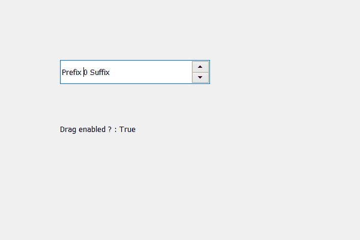

# PyQt5 QSpinbox–检查拖动是否启用

> 原文:[https://www . geesforgeks . org/pyqt 5-qspinbox-检查是否启用了拖动/](https://www.geeksforgeeks.org/pyqt5-qspinbox-checking-if-drag-is-enabled/)

在本文中，我们将看到如何检查是否为整个文本启用了拖动，即包括前缀和后缀。当我们创建一个旋转框时，我们不能从中拖动文本，拖动文本意味着根据光标将选定的文本移动到任何地方，我们使用`setDragEnabled`方法和旋转框的线编辑对象来启用拖动。

为了做到这一点，我们对旋转框的线编辑对象使用 dragEnabled 方法。

> **语法:** line_edit.dragEnabled()
> 
> **论证:**不需要论证
> 
> **返回:**返回 bool

下面是实现

```
# importing libraries
from PyQt5.QtWidgets import * 
from PyQt5 import QtCore, QtGui
from PyQt5.QtGui import * 
from PyQt5.QtCore import * 
import sys

class Window(QMainWindow):

    def __init__(self):
        super().__init__()

        # setting title
        self.setWindowTitle("Python ")

        # setting geometry
        self.setGeometry(100, 100, 600, 400)

        # calling method
        self.UiComponents()

        # showing all the widgets
        self.show()

    # method for widgets
    def UiComponents(self):
        # creating spin box
        self.spin = QSpinBox(self)

        # setting geometry to spin box
        self.spin.setGeometry(100, 100, 250, 40)

        # setting prefix to spin
        self.spin.setPrefix("Prefix ")

        # setting suffix to spin
        self.spin.setSuffix(" Suffix")

        # getting the line edit object
        line = self.spin.lineEdit()

        # enabling the drag
        line.setDragEnabled(True)

        # creating a label
        label = QLabel(self)

        # setting geometry to the label
        label.setGeometry(100, 200, 200, 30)

        # checking if drag is enabled
        check = line.dragEnabled()

        # setting text to the label
        label.setText("Drag enabled ? : " + str(check))

# create pyqt5 app
App = QApplication(sys.argv)

# create the instance of our Window
window = Window()

# start the app
sys.exit(App.exec())
```

**输出:**
