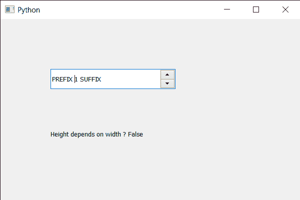

# PyQt5 QSpinBox–检查高度是否取决于宽度

> 原文:[https://www . geesforgeks . org/pyqt5-qspinbox-检查高度是否取决于宽度/](https://www.geeksforgeeks.org/pyqt5-qspinbox-checking-if-height-depend-on-the-width/)

在本文中，我们将看到如何检查旋转框的高度是否取决于旋转框的宽度。取决于宽度的高度意味着当宽度改变时，高度也随之改变。默认情况下，高度不取决于宽度。

为了做到这一点，我们对旋转框对象使用`hasHeightForWidth`方法。

> **语法:**自旋 _ box.hasHeightForWidth()
> 
> **论证:**不需要论证
> 
> **返回:**返回 bool

下面是实现

```py
# importing libraries
from PyQt5.QtWidgets import * 
from PyQt5 import QtCore, QtGui
from PyQt5.QtGui import * 
from PyQt5.QtCore import * 
import sys

class Window(QMainWindow):

    def __init__(self):
        super().__init__()

        # setting title
        self.setWindowTitle("Python ")

        # setting geometry
        self.setGeometry(100, 100, 600, 400)

        # calling method
        self.UiComponents()

        # showing all the widgets
        self.show()

        # method for widgets
    def UiComponents(self):
        # creating spin box
        self.spin = QSpinBox(self)

        # setting geometry to spin box
        self.spin.setGeometry(100, 100, 250, 40)

        # setting range to the spin box
        self.spin.setRange(1, 999999)

        # setting prefix to spin
        self.spin.setPrefix("PREFIX ")

        # setting suffix to spin
        self.spin.setSuffix(" SUFFIX")

        # creating a label
        label = QLabel(self)

        # making the label multi line
        label.setWordWrap(True)

        # setting geometry to the label
        label.setGeometry(100, 200, 200, 60)

        # checking if height depend on the width
        check = self.spin.hasHeightForWidth()

        # setting text to the label
        label.setText("Height depends on width ? " + str(check))

# create pyqt5 app
App = QApplication(sys.argv)

# create the instance of our Window
window = Window()

# start the app
sys.exit(App.exec())
```

**输出:**
