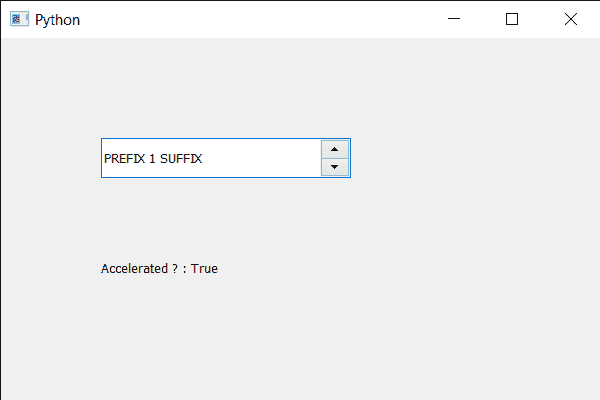

# PyQt5 QSpinBox–检查是否加速

> 原文:[https://www . geeksforgeeks . org/pyqt 5-qspinbox-checking-if-it-accelerated-or-not/](https://www.geeksforgeeks.org/pyqt5-qspinbox-checking-if-it-accelerated-or-not/)

在本文中，我们将了解如何检查旋转框是否加速。加速旋转框意味着在按下步进上/下按钮时加快步进频率。如果旋转框被设置为加速，那么你按住按钮的时间越长，它增加/减少数值的速度就越快。默认情况下旋转框不加速，虽然我们可以使用`setAccelerated`方法让旋转框加速。

为了做到这一点，我们对旋转框对象使用`isAccelerated`方法。

> **语法:**旋转框. isAccelerated()
> 
> **论证:**不需要论证
> 
> **返回:**返回 bool

下面是实现

```
# importing libraries
from PyQt5.QtWidgets import * 
from PyQt5 import QtCore, QtGui
from PyQt5.QtGui import * 
from PyQt5.QtCore import * 
import sys

class Window(QMainWindow):

    def __init__(self):
        super().__init__()

        # setting title
        self.setWindowTitle("Python ")

        # setting geometry
        self.setGeometry(100, 100, 600, 400)

        # calling method
        self.UiComponents()

        # showing all the widgets
        self.show()

        # method for widgets
    def UiComponents(self):
        # creating spin box
        self.spin = QSpinBox(self)

        # setting geometry to spin box
        self.spin.setGeometry(100, 100, 250, 40)

        # setting range to the spin box
        self.spin.setRange(1, 999999)

        # setting prefix to spin
        self.spin.setPrefix("PREFIX ")

        # setting suffix to spin
        self.spin.setSuffix(" SUFFIX")

        # making spin box accelerate
        self.spin.setAccelerated(True)

        # creating a label
        label = QLabel(self)

        # making the label multi line
        label.setWordWrap(True)

        # setting geometry to the label
        label.setGeometry(100, 200, 200, 60)

        # checking if spin box is accelerated
        check = self.spin.isAccelerated()

        # setting text to the label
        label.setText("Accelerated ? : " + str(check))

# create pyqt5 app
App = QApplication(sys.argv)

# create the instance of our Window
window = Window()

# start the app
sys.exit(App.exec())
```

**输出:**
