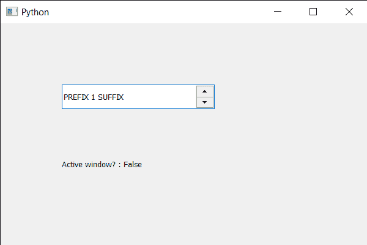

# PyQt5 QSpinBox–检查它是否是活动窗口

> 原文:[https://www . geesforgeks . org/pyqt 5-qspinbox-checking-if-active-window/](https://www.geeksforgeeks.org/pyqt5-qspinbox-checking-if-it-is-active-window/)

在本文中，我们将看到如何检查旋转框是否是活动窗口。活动窗口是包含具有键盘焦点的小部件的窗口(如果该窗口没有小部件或者其小部件都不接受键盘焦点，则该窗口可能仍然具有焦点)。默认情况下，此属性为 false。

为了做到这一点，我们对旋转框对象使用`isActiveWindow`方法。

> **语法:**spin _ box . isaactivewindow()
> 
> **论证:**不需要论证
> 
> **返回:**返回 bool

下面是实现

```py
# importing libraries
from PyQt5.QtWidgets import * 
from PyQt5 import QtCore, QtGui
from PyQt5.QtGui import * 
from PyQt5.QtCore import * 
import sys

class Window(QMainWindow):

    def __init__(self):
        super().__init__()

        # setting title
        self.setWindowTitle("Python ")

        # setting geometry
        self.setGeometry(100, 100, 600, 400)

        # calling method
        self.UiComponents()

        # showing all the widgets
        self.show()

        # method for widgets
    def UiComponents(self):
        # creating spin box
        self.spin = QSpinBox(self)

        # setting geometry to spin box
        self.spin.setGeometry(100, 100, 250, 40)

        # setting range to the spin box
        self.spin.setRange(1, 999999)

        # setting prefix to spin
        self.spin.setPrefix("PREFIX ")

        # setting suffix to spin
        self.spin.setSuffix(" SUFFIX")

        # creating a label
        label = QLabel(self)

        # making the label multi line
        label.setWordWrap(True)

        # setting geometry to the label
        label.setGeometry(100, 200, 200, 60)

        # checking if spin box is active window
        check = self.spin.isActiveWindow()

        # setting text to the label
        label.setText("Active window? : " + str(check))

# create pyqt5 app
App = QApplication(sys.argv)

# create the instance of our Window
window = Window()

# start the app
sys.exit(App.exec())
```

**输出:**
