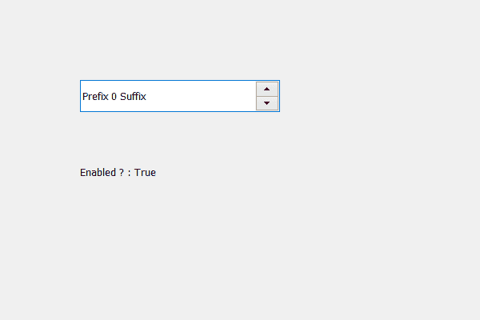

# PyQt5 QSpinBox–检查它是启用还是禁用

> 原文:[https://www . geesforgeks . org/pyqt 5-qspinbox-检查是启用还是禁用/](https://www.geeksforgeeks.org/pyqt5-qspinbox-checking-if-it-is-enabled-or-disabled/)

在本文中，我们将看到如何检查旋转框是启用还是禁用，禁用的旋转框基本上是不能编辑的旋转框，即禁用和启用的旋转框是正常的旋转框，默认情况下旋转框是启用的。为了使旋转框失效，我们使用`setDisabled`方法。

为了做到这一点，我们使用`isEnabled`方法。

> **语法:** spin_box.isEnabled()
> 
> **论证:**不需要论证
> 
> **返回:**返回 bool

下面是实现

```
# importing libraries
from PyQt5.QtWidgets import * 
from PyQt5 import QtCore, QtGui
from PyQt5.QtGui import * 
from PyQt5.QtCore import * 
import sys

class Window(QMainWindow):

    def __init__(self):
        super().__init__()

        # setting title
        self.setWindowTitle("Python ")

        # setting geometry
        self.setGeometry(100, 100, 600, 400)

        # calling method
        self.UiComponents()

        # showing all the widgets
        self.show()

    # method for widgets
    def UiComponents(self):

        # creating spin box
        self.spin = QSpinBox(self)

        # setting geometry to spin box
        self.spin.setGeometry(100, 100, 250, 40)

        # setting prefix to spin
        self.spin.setPrefix("Prefix ")

        # setting suffix to spin
        self.spin.setSuffix(" Suffix")

        # checking if spin box is enabled
        check = self.spin.isEnabled()

        # creating a label
        label = QLabel(self)

        # setting geometry to the label
        label.setGeometry(100, 200, 250, 30)

        # setting text to label
        label.setText("Enabled ? : " + str(check))

# create pyqt5 app
App = QApplication(sys.argv)

# create the instance of our Window
window = Window()

# start the app
sys.exit(App.exec())
```

**输出:**
