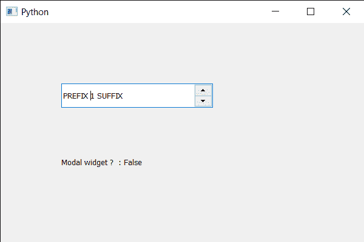

# PyQt5 QSpinBox–检查是否是模态小部件

> 原文:[https://www . geesforgeks . org/pyqt5-qspinbox-checking-if-it-modal-widget/](https://www.geeksforgeeks.org/pyqt5-qspinbox-checking-if-it-is-modal-widget/)

在本文中，我们将看到如何检查旋转框是否是模态小部件。模态小部件是防止所有其他窗口中的小部件获得任何输入的小部件。

为了做到这一点，我们对旋转框对象使用`isModal`方法。

> **语法:** spin_box.isModal()
> 
> **论证:**不需要论证
> 
> **返回:**返回 bool

下面是实现

```
# importing libraries
from PyQt5.QtWidgets import * 
from PyQt5 import QtCore, QtGui
from PyQt5.QtGui import * 
from PyQt5.QtCore import * 
import sys

class Window(QMainWindow):

    def __init__(self):
        super().__init__()

        # setting title
        self.setWindowTitle("Python ")

        # setting geometry
        self.setGeometry(100, 100, 600, 400)

        # calling method
        self.UiComponents()

        # showing all the widgets
        self.show()

        # method for widgets
    def UiComponents(self):
        # creating spin box
        self.spin = QSpinBox(self)

        # setting geometry to spin box
        self.spin.setGeometry(100, 100, 250, 40)

        # setting range to the spin box
        self.spin.setRange(1, 999999)

        # setting prefix to spin
        self.spin.setPrefix("PREFIX ")

        # setting suffix to spin
        self.spin.setSuffix(" SUFFIX")

        # getting child of spin box
        child = self.spin.children()[0]

        # creating a label
        label = QLabel(self)

        # making the label multi line
        label.setWordWrap(True)

        # setting geometry to the label
        label.setGeometry(100, 200, 200, 60)

        # checking if spin box is modal widget
        check = self.spin.isModal()

        # setting text to the label
        label.setText("Modal widget ?  : " + str(check))

# create pyqt5 app
App = QApplication(sys.argv)

# create the instance of our Window
window = Window()

# start the app
sys.exit(App.exec())
```

**输出:**
