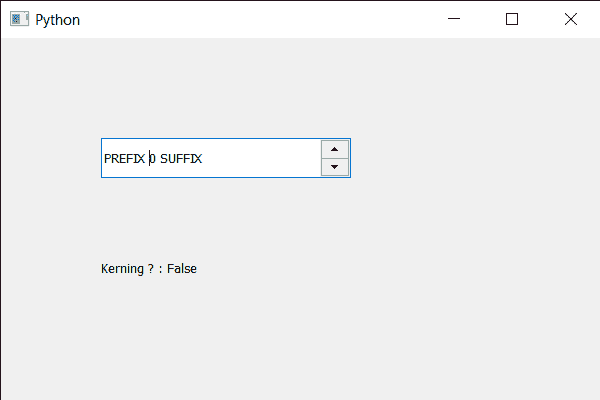

# PyQt5 QSpinBox–检查是否启用字距调整

> 原文:[https://www . geeksforgeeks . org/pyqt 5-qspinbox-checking-如果字距调整被启用或未启用/](https://www.geeksforgeeks.org/pyqt5-qspinbox-checking-if-kerning-is-enabled-or-not/)

在本文中，我们将了解如何检查旋转框文本的字距调整是启用还是禁用。在印刷术中，字距调整是以比例字体调整字符间距的过程，通常是为了达到视觉上令人愉悦的效果。字距调整调整单个字母形式之间的间距，而跟踪在一系列字符上均匀调整间距。默认情况下，该属性为真，尽管我们可以使用旋转框的 QFont 对象使用`setKerning`方法更改该属性。

为了做到这一点，我们对旋转框的 QFont 对象使用`kerning`方法

> **语法:**字体.字距调整()
> 
> **论证:**不需要论证
> 
> **返回:**返回 bool

下面是实现

```py
# importing libraries
from PyQt5.QtWidgets import * 
from PyQt5 import QtCore, QtGui
from PyQt5.QtGui import * 
from PyQt5.QtCore import * 
import sys

class Window(QMainWindow):

    def __init__(self):
        super().__init__()

        # setting title
        self.setWindowTitle("Python ")

        # setting geometry
        self.setGeometry(100, 100, 600, 400)

        # calling method
        self.UiComponents()

        # showing all the widgets
        self.show()

        # method for widgets
    def UiComponents(self):
        # creating spin box
        self.spin = QSpinBox(self)

        # setting geometry to spin box
        self.spin.setGeometry(100, 100, 250, 40)

        # setting range to the spin box
        self.spin.setRange(0, 999999)

        # setting prefix to spin
        self.spin.setPrefix("PREFIX ")

        # setting suffix to spin
        self.spin.setSuffix(" SUFFIX")

        # getting font of the spin box
        font = self.spin.font()

        # disabling the kerning effect
        font.setKerning(False)

        # reassigning this font to the spin box
        self.spin.setFont(font)

        # creating a label
        label = QLabel(self)

        # setting geometry to the label
        label.setGeometry(100, 200, 300, 60)

        # getting kerning status
        check = font.kerning()

        # setting text to the label
        label.setText("Kerning ? : " + str(check))

# create pyqt5 app
App = QApplication(sys.argv)

# create the instance of our Window
window = Window()

# start the app
sys.exit(App.exec())
```

**输出:**
