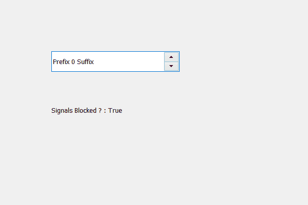

# PyQt5 QSpinBox–检查信号是否受阻

> 原文:[https://www . geeksforgeeks . org/pyqt 5-qspinbox-检查信号是否被阻止/](https://www.geeksforgeeks.org/pyqt5-qspinbox-checking-if-signals-are-blocked-or-not/)

在本文中，我们将了解如何检查信号是否被旋转框阻挡，阻挡信号意味着旋转框的连接方法将不会接收到信号，例如，当我们向其添加动作时，当其值改变时，该动作将不起作用。被阻塞时发出的信号不会被缓冲。为了屏蔽信号，我们使用`blockSignals`方法。

为此，我们使用信号锁定方法。

> **语法:**自旋盒.信号锁定()
> 
> **论证:**不需要论证
> 
> **返回:**返回无

下面是实现

```
# importing libraries
from PyQt5.QtWidgets import * 
from PyQt5 import QtCore, QtGui
from PyQt5.QtGui import * 
from PyQt5.QtCore import * 
import sys

class Window(QMainWindow):

    def __init__(self):
        super().__init__()

        # setting title
        self.setWindowTitle("Python ")

        # setting geometry
        self.setGeometry(100, 100, 600, 400)

        # calling method
        self.UiComponents()

        # showing all the widgets
        self.show()

    # method for widgets
    def UiComponents(self):
        # creating spin box
        self.spin = QSpinBox(self)

        # setting geometry to spin box
        self.spin.setGeometry(100, 100, 250, 40)

        # setting prefix to spin
        self.spin.setPrefix("Prefix ")

        # setting suffix to spin
        self.spin.setSuffix(" Suffix")

        # blocking signals of the spin box
        self.spin.blockSignals(True)

        # creating a label
        self.label = QLabel("Label ", self)

        # setting geometry to the label
        self.label.setGeometry(100, 200, 300, 30)

        # checking if signals are blocked or not
        check = self.spin.signalsBlocked()

        # setting text to the label
        self.label.setText("Signals Blocked ? : " + str(check))

# create pyqt5 app
App = QApplication(sys.argv)

# create the instance of our Window
window = Window()

# start the app
sys.exit(App.exec())
```

**输出:**
