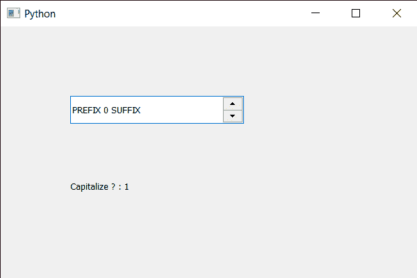

# PyQt5 QSpinBox–检查文本是否大写？

> 原文:[https://www . geesforgeks . org/pyqt5-qspinbox-checking-if-text-is-大写/](https://www.geeksforgeeks.org/pyqt5-qspinbox-checking-if-text-is-capitalize/)

在本文中，我们将看到如何判断旋转框的文本是否大写，为了设置字体，我们使用了以 QFont 对象为参数的 setFont 方法。为了使文本，即字体大写，我们必须获得旋转框的 QFont 对象，然后使其大写，然后将其重新分配给旋转框。

> 为了做到这一点，我们用旋转框的 QFont 对象大写
> 
> **语法:** font .大写()
> 
> **论证:**不需要论证
> 
> **Return :** 如果不大写则返回二进制值 0，如果大写则返回 1

下面是实现

```
# importing libraries
from PyQt5.QtWidgets import * 
from PyQt5 import QtCore, QtGui
from PyQt5.QtGui import * 
from PyQt5.QtCore import * 
import sys

class Window(QMainWindow):

    def __init__(self):
        super().__init__()

        # setting title
        self.setWindowTitle("Python ")

        # setting geometry
        self.setGeometry(100, 100, 600, 400)

        # calling method
        self.UiComponents()

        # showing all the widgets
        self.show()

        # method for widgets
    def UiComponents(self):
        # creating spin box
        self.spin = QSpinBox(self)

        # setting geometry to spin box
        self.spin.setGeometry(100, 100, 250, 40)

        # setting range to the spin box
        self.spin.setRange(0, 999999)

        # setting prefix to spin
        self.spin.setPrefix("Prefix ")

        # setting suffix to spin
        self.spin.setSuffix(" Suffix")

        # getting font of the spin box
        font = self.spin.font()

        # making font capitalize
        font.setCapitalization(True)

        # reassigning the font to the spin box
        self.spin.setFont(font)

        # creating a label
        label = QLabel(self)

        # setting geometry to the label
        label.setGeometry(100, 200, 300, 60)

        # getting capitalize status of text
        check = font.capitalization()

        # setting text to the label
        label.setText("Capitalize ? : " + str(check))

# create pyqt5 app
App = QApplication(sys.argv)

# create the instance of our Window
window = Window()

# start the app
sys.exit(App.exec())
```

**输出:**
