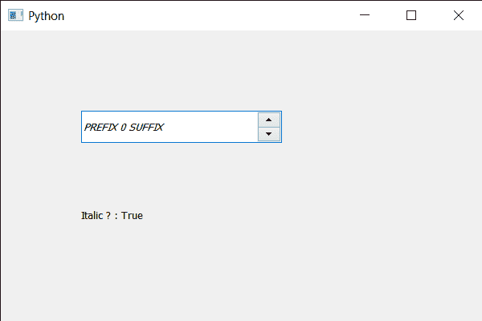

# PyQt5 QSpinBox–检查文本是否为斜体？

> 原文:[https://www . geesforgeks . org/pyqt5-qspinbox-checking-if-text-is-italic/](https://www.geeksforgeeks.org/pyqt5-qspinbox-checking-if-text-is-italic/)

在本文中，我们将看到如何检查旋转框的文本是否是斜体，以便使用以 QFont 对象为参数的 setFont 方法来设置字体。为了使文本，即字体倾斜，我们必须获得旋转框的 QFont 对象，然后使其倾斜，然后将其重新分配给旋转框。

为了获得字体的信息，我们必须获得旋转框的 QFontInfo 对象，这可以使用`fontInfo`方法来完成。

> 为了做到这一点，我们用旋转框的 QFontInfo 对象来倾斜方法
> 
> **语法:** font_info.italic()
> 
> **论证:**不需要论证
> 
> **返回:**返回 bool

下面是实现

```
# importing libraries
from PyQt5.QtWidgets import * 
from PyQt5 import QtCore, QtGui
from PyQt5.QtGui import * 
from PyQt5.QtCore import * 
import sys

class Window(QMainWindow):

    def __init__(self):
        super().__init__()

        # setting title
        self.setWindowTitle("Python ")

        # setting geometry
        self.setGeometry(100, 100, 600, 400)

        # calling method
        self.UiComponents()

        # showing all the widgets
        self.show()

        # method for widgets
    def UiComponents(self):
        # creating spin box
        self.spin = QSpinBox(self)

        # setting geometry to spin box
        self.spin.setGeometry(100, 100, 250, 40)

        # setting range to the spin box
        self.spin.setRange(0, 999999)

        # setting prefix to spin
        self.spin.setPrefix("PREFIX ")

        # setting suffix to spin
        self.spin.setSuffix(" SUFFIX")

        # getting font of the spin box
        font = self.spin.font()

        # making font italic
        font.setItalic(True)

        # reassigning this font to the spin box
        self.spin.setFont(font)

        # creating a label
        label = QLabel(self)

        # setting geometry to the label
        label.setGeometry(100, 200, 300, 60)

        # getting the font info
        font_info = self.spin.fontInfo()

        # getting italic status of text
        check = font_info.italic()

        # setting text to the label
        label.setText("Italic ? : " + str(check))

# create pyqt5 app
App = QApplication(sys.argv)

# create the instance of our Window
window = Window()

# start the app
sys.exit(App.exec())
```

**输出:**
