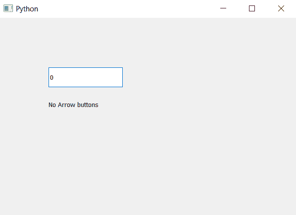

# PyQt5 QSpinBox–检查箭头按钮是否被移除

> 原文:[https://www . geesforgeks . org/pyqt5-qspinbox-检查箭头按钮是否被移除/](https://www.geeksforgeeks.org/pyqt5-qspinbox-checking-if-the-arrow-buttons-are-removed-or-not/)

在本文中，我们将看到如何检查旋转框箭头按钮是否被移除，基本上旋转框中有两个按钮，一个用于增加值，第二个用于减少值。为了移除按钮，我们使用`setButtonSymbols`方法。

为了检查，我们将使用`buttonSymbols`方法。

> **语法:**旋转框.按钮符号()
> 
> **论证:**不需要论证
> 
> **Return :** 它返回 QAbstractSpinBox 对象，但是如果去掉按钮，它的对应值是 2

下面是实现

```
# importing libraries
from PyQt5.QtWidgets import * 
from PyQt5 import QtCore, QtGui
from PyQt5.QtGui import * 
from PyQt5.QtCore import * 
import sys

class Window(QMainWindow):

    def __init__(self):
        super().__init__()

        # setting title
        self.setWindowTitle("Python ")

        # setting geometry
        self.setGeometry(100, 100, 600, 400)

        # calling method
        self.UiComponents()

        # showing all the widgets
        self.show()

    # method for widgets
    def UiComponents(self):

        # creating spin box
        self.spin = QSpinBox(self)

        # setting geometry to spin box
        self.spin.setGeometry(100, 100, 150, 40)

        # removing the buttons
        self.spin.setButtonSymbols(QAbstractSpinBox.NoButtons)

        # creating label
        label = QLabel(self)

        # setting geometry to the label
        label.setGeometry(100, 160, 200, 30)

        # getting the button symbol
        symbol = self.spin.buttonSymbols()

        # checking if arrow button is removed
        if symbol == 2:
            text ="No Arrow buttons"

        else:
            text =" Arrow buttons"

        # setting text to the label
        label.setText(text)

# create pyqt5 app
App = QApplication(sys.argv)

# create the instance of our Window
window = Window()

# start the app
sys.exit(App.exec())
```

**输出:**
