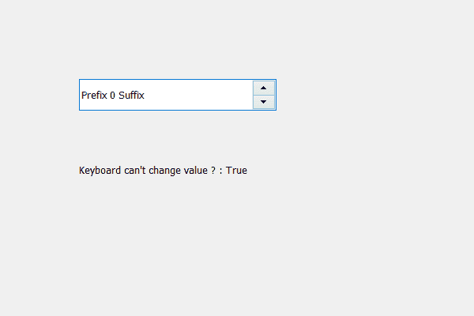

# PyQt5 QSpinBox–检查用户是否可以使用键盘更改数值

> 原文:[https://www . geesforgeks . org/pyqt 5-qspinbox-检查用户是否可以使用键盘更改值/](https://www.geeksforgeeks.org/pyqt5-qspinbox-checking-if-user-can-change-value-using-keyboard-or-not/)

在本文中，我们将看到如何检查用户是否可以使用键盘更改旋转框的值，当我们创建旋转框时，基本上有两种方法来更改旋转框的值，一种是使用箭头按钮，另一种是使用键盘。我们可以用`setReadOnly`方法用它的线编辑对象停止旋转框的键盘输入。

> 为了检查这一点，我们对行编辑对象使用 isReadOnly 方法
> 
> **语法:** line_edit.isReadOnly()
> 
> **论证:**不需要论证
> 
> **返回:**返回 bool

**为了做到这一点我们必须做到以下几点:**
1。创建主窗口
2。创建一个旋转框
3。从旋转框
5 中获取线条编辑对象。创建一个标签来显示结果
6。检查行编辑是否为只读
7。通过标签在屏幕上显示检查值

下面是实现

```
# importing libraries
from PyQt5.QtWidgets import * 
from PyQt5 import QtCore, QtGui
from PyQt5.QtGui import * 
from PyQt5.QtCore import * 
import sys

class Window(QMainWindow):

    def __init__(self):
        super().__init__()

        # setting title
        self.setWindowTitle("Python ")

        # setting geometry
        self.setGeometry(100, 100, 600, 400)

        # calling method
        self.UiComponents()

        # showing all the widgets
        self.show()

    # method for widgets
    def UiComponents(self):
        # creating spin box
        self.spin = QSpinBox(self)

        # setting geometry to spin box
        self.spin.setGeometry(100, 100, 250, 40)

        # setting prefix to spin
        self.spin.setPrefix("Prefix ")

        # setting suffix to spin
        self.spin.setSuffix(" Suffix")

        # getting the line edit
        line = self.spin.lineEdit()

        # making the line edit part read only
        line.setReadOnly(True)

        # creating a label
        label = QLabel(self)

        # setting geometry to the label
        label.setGeometry(100, 200, 300, 30)

        # checking if line edit is read only
        check = line.isReadOnly()

        # setting text to label
        label.setText("Keyboard can't change value ? : " + str(check))

# create pyqt5 app
App = QApplication(sys.argv)

# create the instance of our Window
window = Window()

# start the app
sys.exit(App.exec())
```

**输出:**
