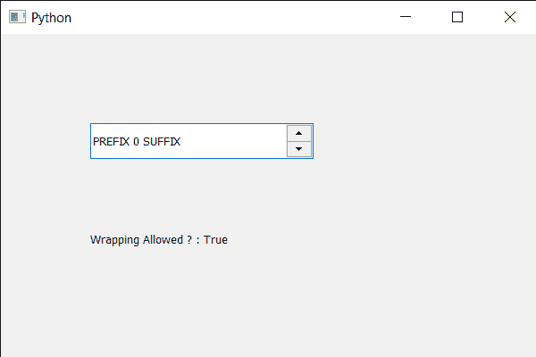

# PyQt5 QSpinBox–检查是否允许包装

> 原文:[https://www . geesforgeks . org/pyqt 5-qspinbox-checking-if-wrapping-is-allow/](https://www.geeksforgeeks.org/pyqt5-qspinbox-checking-if-wrapping-is-allowed/)

在本文中，我们将了解如何检查旋转框中是否允许包装。包装将使从最大值变化值上升到最小值，类似地从最小值变化值下降到最大值，就像循环一样。借助`setWrapping`方法，我们可以在旋转箱中进行包装。

**注意:**只有设置了最小值和最大值时，换行才有意义。

为了做到这一点，我们对旋转框对象使用`wrapping`方法。

> **语法:**旋转包围()
> 
> **论证:**不需要论证
> 
> **返回:**返回 bool

下面是实现

```py
# importing libraries
from PyQt5.QtWidgets import * from PyQt5 import QtCore, QtGui
from PyQt5.QtGui import * from PyQt5.QtCore import * import sys

class Window(QMainWindow):

    def __init__(self):
        super().__init__()

        # setting title
        self.setWindowTitle("Python ")

        # setting geometry
        self.setGeometry(100, 100, 600, 400)

        # calling method
        self.UiComponents()

        # showing all the widgets
        self.show()

        # method for widgets
    def UiComponents(self):
        # creating spin box
        self.spin = QSpinBox(self)

        # setting geometry to spin box
        self.spin.setGeometry(100, 100, 250, 40)

        # setting range to the spin box
        self.spin.setRange(0, 9)

        # setting prefix to spin
        self.spin.setPrefix("PREFIX ")

        # setting suffix to spin
        self.spin.setSuffix(" SUFFIX")

        # making spin box wrapping the value
        self.spin.setWrapping(True)

        # setting status tip to the spin box
        self.spin.setStatusTip("Small Value")

        # creating a label
        self.label = QLabel(self)

        # making label multi line
        self.label.setWordWrap(True)

        # setting label geometry
        self.label.setGeometry(100, 200, 250, 60)

        # checking the wrapping is allowed
        value = self.spin.wrapping()

        # setting text to the label
        self.label.setText("Wrapping Allowed ? : " + str(value))

# create pyqt5 app
App = QApplication(sys.argv)

# create the instance of our Window
window = Window()

# start the app
sys.exit(App.exec())
```

**输出:**
