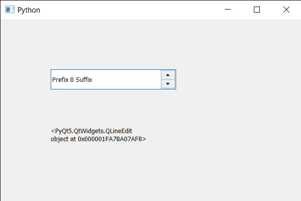

# PyQt5 QSpinBox–使用 ID 查找孩子

> 原文:[https://www . geesforgeks . org/pyqt5-qspinbox-find-child-using-id/](https://www.geeksforgeeks.org/pyqt5-qspinbox-finding-child-using-id/)

在本文中我们将看到如何使用子 id 找到旋转框的子，我们可以使用`winId`方法以子为对象获取子 ID。旋转框是父部件，它有子部件，如线编辑部件和那些向上和向下按钮。

> 为了做到这一点，我们使用查找方法
> 
> **语法:**自旋 _box.find(id)
> 
> **参数:**以子 id 为参数
> 
> **返回:**返回子对象

下面是实现

```py
# importing libraries
from PyQt5.QtWidgets import * 
from PyQt5 import QtCore, QtGui
from PyQt5.QtGui import * 
from PyQt5.QtCore import * 
import sys

class Window(QMainWindow):

    def __init__(self):
        super().__init__()

        # setting title
        self.setWindowTitle("Python ")

        # setting geometry
        self.setGeometry(100, 100, 600, 400)

        # calling method
        self.UiComponents()

        # showing all the widgets
        self.show()

        # method for widgets
    def UiComponents(self):
        # creating spin box
        self.spin = QSpinBox(self)

        # setting geometry to spin box
        self.spin.setGeometry(100, 100, 250, 40)

        # setting range to the spin box
        self.spin.setRange(0, 999999)

        # setting prefix to spin
        self.spin.setPrefix("Prefix ")

        # setting suffix to spin
        self.spin.setSuffix(" Suffix")

        # ensuring spin box is polished
        i_d = self.spin.lineEdit().winId()

        # getting child using ID
        child = self.spin.find(i_d)

        # creating a label
        label = QLabel(self)

        # making it multi line
        label.setWordWrap(True)

        # setting its geometry
        label.setGeometry(100, 200, 200, 60)

        # setting text to the label
        label.setText(str(child))

# create pyqt5 app
App = QApplication(sys.argv)

# create the instance of our Window
window = Window()

# start the app
sys.exit(App.exec())
```

**输出:**
