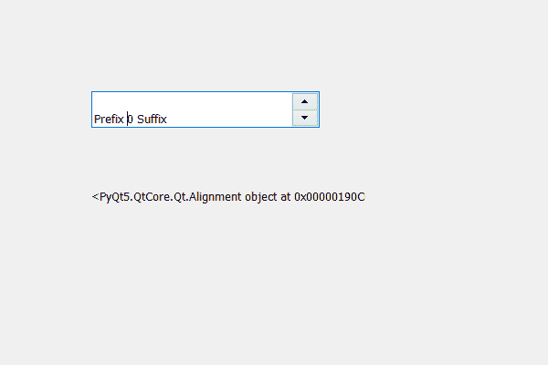

# PyQt5 QSpinBox–获得校准

> 原文:[https://www . geeksforgeeks . org/pyqt 5-qspinbox-get-alignment/](https://www.geeksforgeeks.org/pyqt5-qspinbox-getting-alignment/)

在本文中，我们将看到如何获得旋转框的对齐方式，默认情况下，旋转框文本是左对齐的。虽然我们可以更改它，但旋转框有许多对齐方式。

为了获得旋转框的对齐标志，我们使用对齐方法。

> **语法:**旋转框对齐()
> 
> **论证:**不需要论证
> 
> **返回:**返回 Qt。对准对象，即对准标志。

**注意:**用这种方法返回的对象也可以用来设置其他对齐方式。

下面是实现

```
# importing libraries
from PyQt5.QtWidgets import * 
from PyQt5 import QtCore, QtGui
from PyQt5.QtGui import * 
from PyQt5.QtCore import * 
import sys

class Window(QMainWindow):

    def __init__(self):
        super().__init__()

        # setting title
        self.setWindowTitle("Python ")

        # setting geometry
        self.setGeometry(100, 100, 600, 400)

        # calling method
        self.UiComponents()

        # showing all the widgets
        self.show()

    # method for widgets
    def UiComponents(self):
        # creating spin box
        self.spin = QSpinBox(self)

        # setting geometry to spin box
        self.spin.setGeometry(100, 100, 250, 40)

        # setting prefix to spin
        self.spin.setPrefix("Prefix ")

        # setting suffix to spin
        self.spin.setSuffix(" Suffix")

        # setting alignment to the spin box
        self.spin.setAlignment(Qt.AlignBottom)

        # creating a label
        label = QLabel(self)

        # getting the alignment of the spin box
        get_alignmnet = self.spin.alignment()

        # setting text to the label
        label.setText(str(get_alignmnet))

        # setting geometry to the label
        label.setGeometry(100, 200, 300, 30)

# create pyqt5 app
App = QApplication(sys.argv)

# create the instance of our Window
window = Window()

# start the app
sys.exit(App.exec())
```

**输出:**
