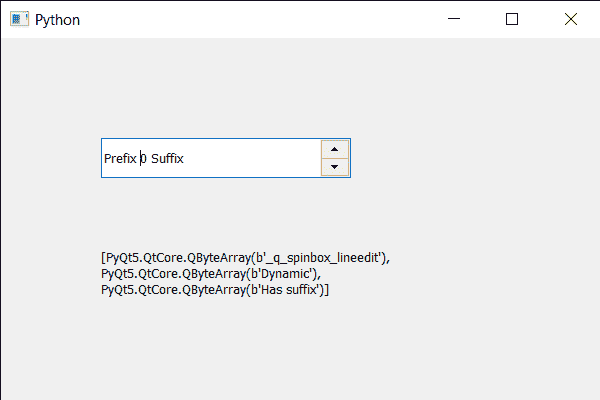

# PyQt5 QSpinBox–获取所有属性名称

> 原文:[https://www . geesforgeks . org/pyqt5-qspinbox-get-all-properties-name/](https://www.geeksforgeeks.org/pyqt5-qspinbox-getting-all-the-properties-names/)

在本文中，我们将看到如何获得动态添加到其中的旋转框的所有属性名称，属性是开发人员添加的信息，用于讲述旋转框的属性，例如，如果旋转框能够循环值，开发人员将添加该属性，以便其他开发人员可以看到并了解该属性。使用`setProperty`方法添加属性。

> 为了做到这一点，我们使用**动态属性名称**方法
> 
> **语法:**spin _ box . dynamic property name()
> 
> **论证:**不需要论证
> 
> **返回:**返回列表

下面是实现

```
# importing libraries
from PyQt5.QtWidgets import * 
from PyQt5 import QtCore, QtGui
from PyQt5.QtGui import * 
from PyQt5.QtCore import * 
import sys

class Window(QMainWindow):

    def __init__(self):
        super().__init__()

        # setting title
        self.setWindowTitle("Python ")

        # setting geometry
        self.setGeometry(100, 100, 600, 400)

        # calling method
        self.UiComponents()

        # showing all the widgets
        self.show()

        # method for widgets
    def UiComponents(self):
        # creating spin box
        self.spin = QSpinBox(self)

        # setting geometry to spin box
        self.spin.setGeometry(100, 100, 250, 40)

        # setting range to the spin box
        self.spin.setRange(0, 999999)

        # setting prefix to spin
        self.spin.setPrefix("Prefix ")

        # setting suffix to spin
        self.spin.setSuffix(" Suffix")

        # adding property to the spin box
        self.spin.setProperty("Dynamic", 1)

        # adding property to the spin box
        self.spin.setProperty("Has suffix", 1)

        # creating label
        self.label = QLabel(self)

        # setting geometry to the label
        self.label.setGeometry(100, 200, 300, 70)

        # making it multi line label
        self.label.setWordWrap(True)

        # getting property names
        p_names = self.spin.dynamicPropertyNames()

        # setting text to the label
        self.label.setText(str(p_names))

# create pyqt5 app
App = QApplication(sys.argv)

# create the instance of our Window
window = Window()
window.spin.setFocus()
# start the app
sys.exit(App.exec())
```

**输出:**
