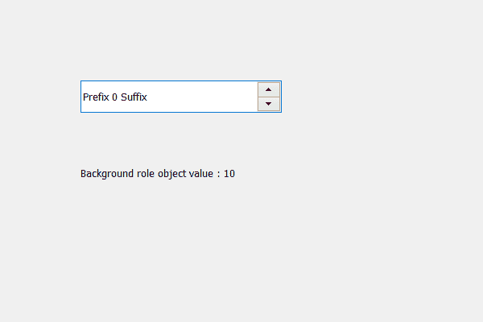

# PyQt5 QSpinBox–获取背景角色

> 原文:[https://www . geeksforgeeks . org/pyqt 5-qspinbox-get-background-role/](https://www.geeksforgeeks.org/pyqt5-qspinbox-getting-background-role/)

在本文中，我们将看到如何获得旋转框的背景角色，旋转框中基本上有两种类型的角色，一种是前景，另一种是背景。背景角色从旋转框的调色板中定义用于渲染背景的画笔。如果未设置显式背景角色，旋转框将继承其父小部件的背景角色。为了设置这个，我们使用了 setBackgroundRole 方法。

为此，我们使用了 backgroundRole 方法。

> **语法:**spin _ box . background role()
> 参数:不需要参数
> **返回:**返回 QPalette。ColorRole 对象，但打印时显示其值

下面是实现

## 蟒蛇 3

```py
# importing libraries
from PyQt5.QtWidgets import *
from PyQt5 import QtCore, QtGui
from PyQt5.QtGui import *
from PyQt5.QtCore import *
import sys

class Window(QMainWindow):

    def __init__(self):
        super().__init__()

        # setting title
        self.setWindowTitle("Python ")

        # setting geometry
        self.setGeometry(100, 100, 600, 400)

        # calling method
        self.UiComponents()

        # showing all the widgets
        self.show()

    # method for widgets
    def UiComponents(self):
        # creating spin box
        self.spin = QSpinBox(self)

        # setting geometry to spin box
        self.spin.setGeometry(100, 100, 250, 40)

        # setting prefix to spin
        self.spin.setPrefix("Prefix ")

        # setting suffix to spin
        self.spin.setSuffix(" Suffix")

        # creating a label
        label = QLabel(self)

        # setting geometry to the label
        label.setGeometry(100, 200, 300, 30)

        # getting the background role object
        object = self.backgroundRole()

        # setting text to the label
        label.setText("Background role object value : " + str(object))

# create pyqt5 app
App = QApplication(sys.argv)

# create the instance of our Window
window = Window()

# start the app
sys.exit(App.exec())
```

**输出:**

