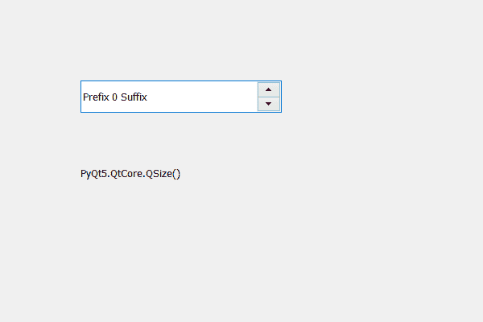

# PyQt5 QSpinBox–获取基本尺寸

> 原文:[https://www . geeksforgeeks . org/pyqt 5-qspinbox-get-base-size/](https://www.geeksforgeeks.org/pyqt5-qspinbox-getting-base-size/)

在本文中，我们将看到如何设置旋转框的基本尺寸，如果旋转框定义了`sizeIncrement`，基本尺寸用于计算合适的旋转框尺寸。默认情况下，对于新创建的旋转框，此属性包含宽度和高度为零的大小。为了设置基本尺寸，我们使用`setBaseSize`方法。

为了得到基本尺寸，我们使用基本尺寸方法。

> **语法:**自旋 _box.baseSize()
> 
> **论证:**不需要论证
> 
> **返回:**返回 QSize 对象

下面是实现

```
# importing libraries
from PyQt5.QtWidgets import * 
from PyQt5 import QtCore, QtGui
from PyQt5.QtGui import * 
from PyQt5.QtCore import * 
import sys

class Window(QMainWindow):

    def __init__(self):
        super().__init__()

        # setting title
        self.setWindowTitle("Python ")

        # setting geometry
        self.setGeometry(100, 100, 600, 400)

        # calling method
        self.UiComponents()

        # showing all the widgets
        self.show()

    # method for widgets
    def UiComponents(self):
        # creating spin box
        self.spin = QSpinBox(self)

        # setting geometry to spin box
        self.spin.setGeometry(100, 100, 250, 40)

        # setting prefix to spin
        self.spin.setPrefix("Prefix ")

        # setting suffix to spin
        self.spin.setSuffix(" Suffix")

        # setting base size
        self.spin.setBaseSize(250, 40)

        # creating a label
        label = QLabel(self)

        # setting geometry to the label
        label.setGeometry(100, 200, 300, 30)

        # getting the base size
        base = self.baseSize()

        # setting text to the label
        label.setText(str(base))

# create pyqt5 app
App = QApplication(sys.argv)

# create the instance of our Window
window = Window()

# start the app
sys.exit(App.exec())
```

**输出:**
