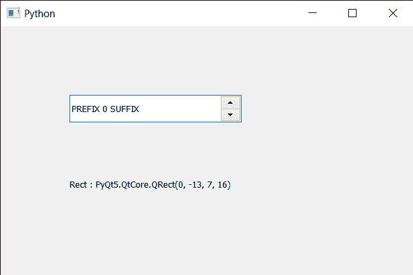

# PyQt5 QSpinBox–获取字符的边框

> 原文:[https://www . geeksforgeeks . org/pyqt 5-qspinbox-get-字符边框/](https://www.geeksforgeeks.org/pyqt5-qspinbox-getting-bounding-rectangle-of-the-character/)

在本文中，我们将看到如何获得旋转框中给定字符的边界矩形，即如果字符“ch”在坐标系的原点绘制，则被墨水覆盖的矩形。边框可以延伸到(0，0)的左边(例如，对于斜体字体)，并且文本输出可以覆盖边框中的所有像素。对于空格字符，矩形通常为空。

为了做到这一点，我们对旋转框的 QFontMetrics 对象使用`boundingRect`方法。

> **语法:**font _ metrics . boundingrect(ch)
> 
> **自变量:**以字符串为自变量
> 
> **返回:**返回 QRect 对象

**注意:**这个方法也可以用来获取整篇文字的边框

下面是实现

```
# importing libraries
from PyQt5.QtWidgets import * 
from PyQt5 import QtCore, QtGui
from PyQt5.QtGui import * 
from PyQt5.QtCore import * 
import sys

class Window(QMainWindow):

    def __init__(self):
        super().__init__()

        # setting title
        self.setWindowTitle("Python ")

        # setting geometry
        self.setGeometry(100, 100, 600, 400)

        # calling method
        self.UiComponents()

        # showing all the widgets
        self.show()

        # method for widgets
    def UiComponents(self):
        # creating spin box
        self.spin = QSpinBox(self)

        # setting geometry to spin box
        self.spin.setGeometry(100, 100, 250, 40)

        # setting range to the spin box
        self.spin.setRange(0, 999999)

        # setting prefix to spin
        self.spin.setPrefix("PREFIX ")

        # setting suffix to spin
        self.spin.setSuffix(" SUFFIX")

        # creating a label
        label = QLabel(self)

        # making label multi line
        label.setWordWrap(True)

        # setting geometry to the label
        label.setGeometry(100, 200, 300, 60)

        # getting font metrics
        f_metrics = self.spin.fontMetrics()

        # getting average character width
        rec = f_metrics.boundingRect('S')

        # setting text to the label
        label.setText("Rect : " + str(rec))

# create pyqt5 app
App = QApplication(sys.argv)

# create the instance of our Window
window = Window()

# start the app
sys.exit(App.exec())
```

**输出:**
