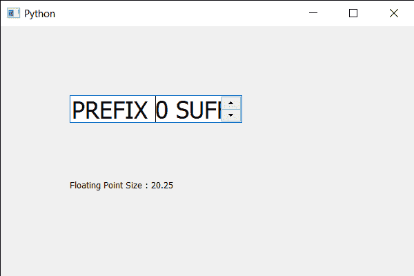

# PyQt5 QSpinBox–获取浮点大小| pointSizeF()方法

> 原文:[https://www . geesforgeks . org/pyqt5-qspinbox-get-float-size-pointsizef-method/](https://www.geeksforgeeks.org/pyqt5-qspinbox-getting-float-point-size-pointsizef-method/)

在本文中，我们将看到如何在旋转框中获得文本的浮点大小。改变点的大小会改变文字的大小，像素和点是两回事有些东西点里面可以有多个像素。建议更改点大小以改变文本的大小。与正常的点大小不同，浮点大小可以使点大小以十进制表示，因为点大小不是一个像素，它的值也可以是浮点的，因为正常的 get 方法不会得到浮点值，因为它只得到整数值。

为了做到这一点，我们对旋转框的 QFont 对象使用`pointSizeF`方法

> **语法:**font . pointsizeef()
> 
> **论证:**不需要论证
> 
> **返回:**返回浮点值

下面是实现

```
# importing libraries
from PyQt5.QtWidgets import * 
from PyQt5 import QtCore, QtGui
from PyQt5.QtGui import * 
from PyQt5.QtCore import * 
import sys

class Window(QMainWindow):

    def __init__(self):
        super().__init__()

        # setting title
        self.setWindowTitle("Python ")

        # setting geometry
        self.setGeometry(100, 100, 600, 400)

        # calling method
        self.UiComponents()

        # showing all the widgets
        self.show()

        # method for widgets
    def UiComponents(self):
        # creating spin box
        self.spin = QSpinBox(self)

        # setting geometry to spin box
        self.spin.setGeometry(100, 100, 250, 40)

        # setting range to the spin box
        self.spin.setRange(0, 999999)

        # setting prefix to spin
        self.spin.setPrefix("PREFIX ")

        # setting suffix to spin
        self.spin.setSuffix(" SUFFIX")

        # getting font of the spin box
        font = self.spin.font()

        # setting point size F
        font.setPointSizeF(20.25)

        # reassigning this font to the spin box
        self.spin.setFont(font)

        # creating a label
        label = QLabel(self)

        # setting geometry to the label
        label.setGeometry(100, 200, 300, 60)

        # getting point size F
        p_size = font.pointSizeF()

        # setting text to the label
        label.setText("Floating Point Size : " + str(p_size))

# create pyqt5 app
App = QApplication(sys.argv)

# create the instance of our Window
window = Window()

# start the app
sys.exit(App.exec())
```

**输出:**
