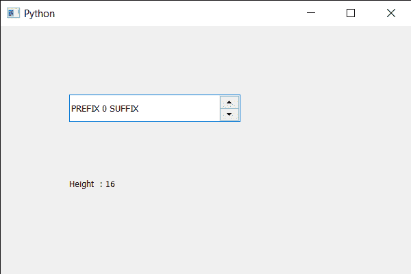

# PyQt5 QSpinBox–获取字体高度

> 原文:[https://www . geesforgeks . org/pyqt 5-qspinbox-get-height-of-font/](https://www.geeksforgeeks.org/pyqt5-qspinbox-getting-height-of-font/)

在本文中，我们将看到如何获得旋转框字体的高度，即它的文本。高度是文本的垂直长度。字体高度始终等于上升+下降+1(1 代表基线)。

为了做到这一点，我们对旋转框的 QFontMetrics 对象使用`height`方法。

> **语法:** font_metrics.height()
> 
> **论证:**不需要论证
> 
> **返回:**返回整数。

下面是实现

```py
# importing libraries
from PyQt5.QtWidgets import * 
from PyQt5 import QtCore, QtGui
from PyQt5.QtGui import * 
from PyQt5.QtCore import * 
import sys

class Window(QMainWindow):

    def __init__(self):
        super().__init__()

        # setting title
        self.setWindowTitle("Python ")

        # setting geometry
        self.setGeometry(100, 100, 600, 400)

        # calling method
        self.UiComponents()

        # showing all the widgets
        self.show()

        # method for widgets
    def UiComponents(self):
        # creating spin box
        self.spin = QSpinBox(self)

        # setting geometry to spin box
        self.spin.setGeometry(100, 100, 250, 40)

        # setting range to the spin box
        self.spin.setRange(0, 999999)

        # setting prefix to spin
        self.spin.setPrefix("PREFIX ")

        # setting suffix to spin
        self.spin.setSuffix(" SUFFIX")

        # creating a label
        label = QLabel(self)

        # making label multi line
        label.setWordWrap(True)

        # setting geometry to the label
        label.setGeometry(100, 200, 300, 60)

        # getting font metrics
        f_metrics = self.spin.fontMetrics()

        # getting height of the font
        height = f_metrics.height()

        # setting text to the label
        label.setText("Height  : " + str(height))

# create pyqt5 app
App = QApplication(sys.argv)

# create the instance of our Window
window = Window()

# start the app
sys.exit(App.exec())
```

**输出:**
