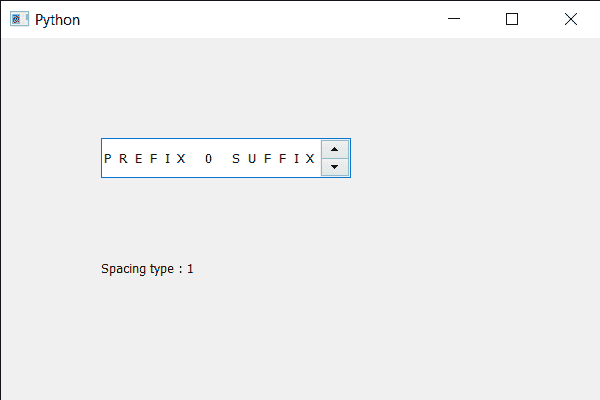

# PyQt5 QSpinBox–获取字母间距类型

> 原文:[https://www . geesforgeks . org/pyqt5-qspinbox-get-字母-间距-type/](https://www.geeksforgeeks.org/pyqt5-qspinbox-getting-letter-spacing-type/)

在本文中，我们将看到如何获得旋转框文本的字母间距类型，字母间距是两个连续字母之间的距离(间隙)。可以通过指定像素或百分比来更改间距。为了设置间距，我们对旋转框的 QFont 对象使用`setLetterSpacing`方法。

字母间距有两种类型，第一种是默认的百分比间距，其值为 0，它通过接受 0 像素百分比值为 100 的百分比值来设置值。另一种类型是绝对的假设它的值是 1，它通过接受像素值来设置值。

为了做到这一点，我们对旋转框的 QFont 对象使用`letterSpacingType`方法

> **语法:** font.letterSpacingType()
> 
> **论证:**不需要论证
> 
> **返回:**返回间距类型，打印时只显示类型值

下面是实现

```py
# importing libraries
from PyQt5.QtWidgets import * 
from PyQt5 import QtCore, QtGui
from PyQt5.QtGui import * 
from PyQt5.QtCore import * 
import sys

class Window(QMainWindow):

    def __init__(self):
        super().__init__()

        # setting title
        self.setWindowTitle("Python ")

        # setting geometry
        self.setGeometry(100, 100, 600, 400)

        # calling method
        self.UiComponents()

        # showing all the widgets
        self.show()

        # method for widgets
    def UiComponents(self):
        # creating spin box
        self.spin = QSpinBox(self)

        # setting geometry to spin box
        self.spin.setGeometry(100, 100, 250, 40)

        # setting range to the spin box
        self.spin.setRange(0, 999999)

        # setting prefix to spin
        self.spin.setPrefix("PREFIX ")

        # setting suffix to spin
        self.spin.setSuffix(" SUFFIX")

        # getting font of the spin box
        font = self.spin.font()

        # setting letter spacing
        font.setLetterSpacing(QFont.AbsoluteSpacing, 8)

        # reassigning this font to the spin box
        self.spin.setFont(font)

        # creating a label
        label = QLabel(self)

        # setting geometry to the label
        label.setGeometry(100, 200, 300, 60)

        # getting letter spacing type
        space_type = font.letterSpacingType()

        # setting text to the label
        label.setText("Spacing type : " + str(space_type))

# create pyqt5 app
App = QApplication(sys.argv)

# create the instance of our Window
window = Window()

# start the app
sys.exit(App.exec())
```

**输出:**
