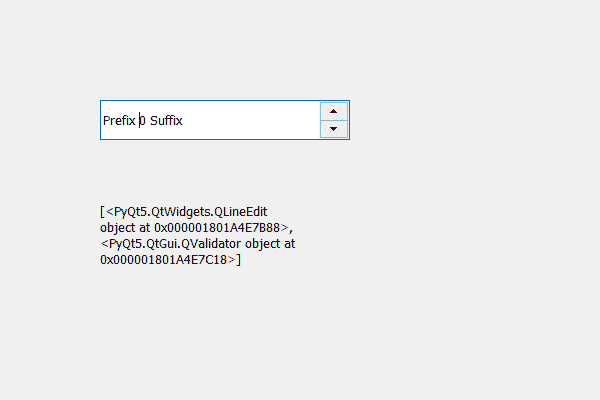

# PyQt5 QSpinBox–获取孩子列表

> 原文:[https://www . geesforgeks . org/pyqt 5-qspinbox-get-list-of-children/](https://www.geeksforgeeks.org/pyqt5-qspinbox-getting-list-of-children/)

在本文中，我们将看到如何获得旋转框的子元素，子元素基本上是旋转框的组件，例如旋转框的主要组件是它的 QLineEdit，用于查看值和设置值。

为了做到这一点，我们使用儿童方法。

> **语法:**自旋 _box.children()
> 
> **论证:**不需要论证
> 
> **返回:**返回列表

下面是实现

```py
# importing libraries
from PyQt5.QtWidgets import * 
from PyQt5 import QtCore, QtGui
from PyQt5.QtGui import * 
from PyQt5.QtCore import * 
import sys

class Window(QMainWindow):

    def __init__(self):
        super().__init__()

        # setting title
        self.setWindowTitle("Python ")

        # setting geometry
        self.setGeometry(100, 100, 600, 400)

        # calling method
        self.UiComponents()

        # showing all the widgets
        self.show()

    # method for widgets
    def UiComponents(self):
        # creating spin box
        self.spin = QSpinBox(self)

        # setting geometry to spin box
        self.spin.setGeometry(100, 100, 250, 40)

        # setting prefix to spin
        self.spin.setPrefix("Prefix ")

        # setting suffix to spin
        self.spin.setSuffix(" Suffix")

        # creating a label
        self.label = QLabel("Label ", self)

        # setting geometry to the label
        self.label.setGeometry(100, 200, 200, 70)

        # getting all the children of the spin box
        children = self.spin.children()

        # setting text to the label
        self.label.setText(str(children))

        # making label multi line
        self.label.setWordWrap(True)

# create pyqt5 app
App = QApplication(sys.argv)

# create the instance of our Window
window = Window()

# start the app
sys.exit(App.exec())
```

**输出:**
