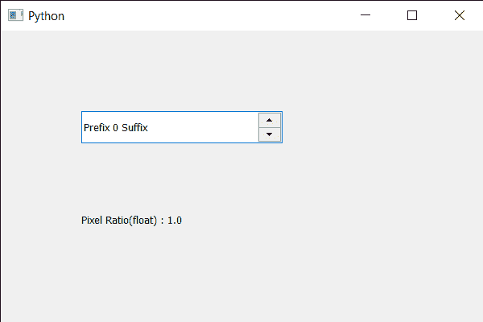

# PyQt5 QSpinBox–获取像素比率作为浮动值

> 原文:[https://www . geeksforgeeks . org/pyqt 5-qspinbox-get-pixel-ratio-as-floating-value/](https://www.geeksforgeeks.org/pyqt5-qspinbox-getting-pixel-ratio-as-floating-value/)

在本文中，我们将看到如何在浮动值中获得旋转框的像素比率。设备像素比率是旋转框的物理像素和逻辑像素之间的比率。对于正常 dpi 显示器，常用值为 1，对于高 dpi“视网膜”显示器，常用值为 2。我们可以用`devicePixelRatio`方法得到像素比，但它不是浮点值。

> 为了做到这一点，我们使用 devicePixelRatioF 方法
> 
> **语法:**spin _ box . devicepixelritf()
> 
> **论证:**不需要论证
> 
> **返回:**返回浮动

下面是实现

```py
# importing libraries
from PyQt5.QtWidgets import * 
from PyQt5 import QtCore, QtGui
from PyQt5.QtGui import * 
from PyQt5.QtCore import * 
import sys

class Window(QMainWindow):

    def __init__(self):
        super().__init__()

        # setting title
        self.setWindowTitle("Python ")

        # setting geometry
        self.setGeometry(100, 100, 600, 400)

        # calling method
        self.UiComponents()

        # showing all the widgets
        self.show()

        # method for widgets
    def UiComponents(self):
        # creating spin box
        self.spin = QSpinBox(self)

        # setting geometry to spin box
        self.spin.setGeometry(100, 100, 250, 40)

        # setting range to the spin box
        self.spin.setRange(0, 999999)

        # setting prefix to spin
        self.spin.setPrefix("Prefix ")

        # setting suffix to spin
        self.spin.setSuffix(" Suffix")

        # getting pixel ratio in floating value
        pixel_ratio = self.spin.devicePixelRatioF()

        # creating label
        label = QLabel(self)

        # setting geometry to the label
        label.setGeometry(100, 200, 200, 70)

        # making it multi line label
        label.setWordWrap(True)

        # setting text to the label
        label.setText("Pixel Ratio(float) : " + str(pixel_ratio))

# create pyqt5 app
App = QApplication(sys.argv)

# create the instance of our Window
window = Window()
window.spin.setFocus()
# start the app
sys.exit(App.exec())
```

**输出:**
