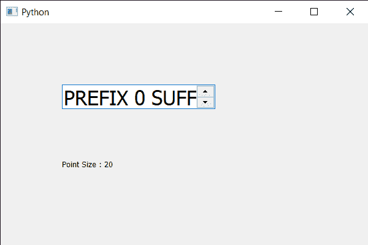

# PyQt5 QSpinBox–获取点大小

> 原文:[https://www . geeksforgeeks . org/pyqt 5-qspinbox-get-point-size/](https://www.geeksforgeeks.org/pyqt5-qspinbox-getting-point-size/)

在本文中，我们将看到如何在旋转框中获得文本的磅值。改变点的大小会改变文字的大小，像素和点是两回事有些东西点里面可以有多个像素。改变文字大小建议改变点大小，可以使用`setPointSize`方法改变。

为了做到这一点，我们对旋转框的 QFont 对象使用`pointSize`方法

> **语法:** font.pointSize()
> 
> **论证:**不需要论证
> 
> **返回:**返回整数

下面是实现

```py
# importing libraries
from PyQt5.QtWidgets import * 
from PyQt5 import QtCore, QtGui
from PyQt5.QtGui import * 
from PyQt5.QtCore import * 
import sys

class Window(QMainWindow):

    def __init__(self):
        super().__init__()

        # setting title
        self.setWindowTitle("Python ")

        # setting geometry
        self.setGeometry(100, 100, 600, 400)

        # calling method
        self.UiComponents()

        # showing all the widgets
        self.show()

        # method for widgets
    def UiComponents(self):
        # creating spin box
        self.spin = QSpinBox(self)

        # setting geometry to spin box
        self.spin.setGeometry(100, 100, 250, 40)

        # setting range to the spin box
        self.spin.setRange(0, 999999)

        # setting prefix to spin
        self.spin.setPrefix("PREFIX ")

        # setting suffix to spin
        self.spin.setSuffix(" SUFFIX")

        # getting font of the spin box
        font = self.spin.font()

        # setting point size
        font.setPointSize(20)

        # reassigning this font to the spin box
        self.spin.setFont(font)

        # creating a label
        label = QLabel(self)

        # setting geometry to the label
        label.setGeometry(100, 200, 300, 60)

        # getting point size
        p_size = font.pointSize()

        # setting text to the label
        label.setText("Point Size : " + str(p_size))

# create pyqt5 app
App = QApplication(sys.argv)

# create the instance of our Window
window = Window()

# start the app
sys.exit(App.exec())
```

**输出:**
