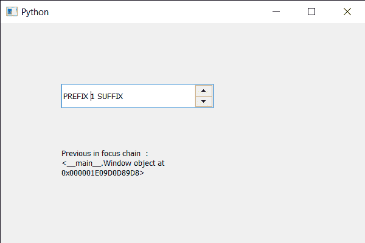

# PyQt5 QSpinBox–获取焦点链中的上一个小部件

> 原文:[https://www . geesforgeks . org/pyqt5-qspinbox-get-previous-widget-in-focus-chain/](https://www.geeksforgeeks.org/pyqt5-qspinbox-getting-previous-widget-in-focus-chain/)

在这篇文章中，我们将看到我们如何能够获得之前在旋转框的焦点链小部件。旋转框由两个子部件组成，一个是行编辑，另一个是箭头按钮。焦点是由窗口小部件设置的，即焦点链，因此当旋转框获得焦点时，它的一个子窗口在另一个子窗口之前获得焦点，类似地，在旋转框之前，主窗口进入焦点链。

为了做到这一点，我们对旋转框对象使用`previousInFocusChain`方法。

> **语法:**自旋 _ box.previousInFocusChain()
> 
> **论证:**不需要论证
> 
> **返回:**返回 QWidget 对象

下面是实现

```
# importing libraries
from PyQt5.QtWidgets import * 
from PyQt5 import QtCore, QtGui
from PyQt5.QtGui import * 
from PyQt5.QtCore import * 
import sys

class Window(QMainWindow):

    def __init__(self):
        super().__init__()

        # setting title
        self.setWindowTitle("Python ")

        # setting geometry
        self.setGeometry(100, 100, 600, 400)

        # calling method
        self.UiComponents()

        # showing all the widgets
        self.show()

        # method for widgets
    def UiComponents(self):
        # creating spin box
        self.spin = QSpinBox(self)

        # setting geometry to spin box
        self.spin.setGeometry(100, 100, 250, 40)

        # setting range to the spin box
        self.spin.setRange(1, 999999)

        # setting prefix to spin
        self.spin.setPrefix("PREFIX ")

        # setting suffix to spin
        self.spin.setSuffix(" SUFFIX")

        # creating a label
        label = QLabel(self)

        # making the label multi line
        label.setWordWrap(True)

        # setting geometry to the label
        label.setGeometry(100, 200, 200, 60)

        # getting previous widget in focus chain
        value = self.spin.previousInFocusChain()

        # setting text to the label
        label.setText("Previous in focus chain  : " + str(value))

# create pyqt5 app
App = QApplication(sys.argv)

# create the instance of our Window
window = Window()

# start the app
sys.exit(App.exec())
```

**输出:**
