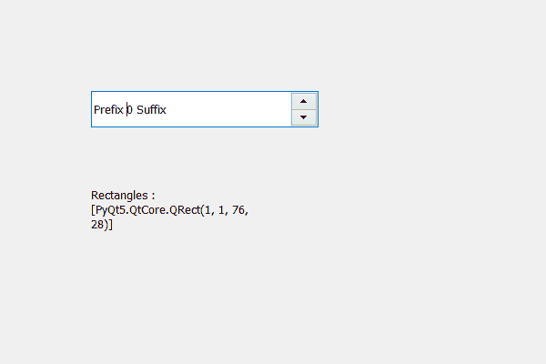

# PyQt5 QSpinBox–获取子区域的矩形

> 原文:[https://www . geeksforgeeks . org/pyqt 5-qspinbox-get-儿童矩形-region/](https://www.geeksforgeeks.org/pyqt5-qspinbox-getting-rectangles-of-children-region/)

在本文中，我们将看到如何获得旋转框的子区域中的矩形，子区域包含旋转框的子区域占据的组合区域。为了得到孩子区域，我们使用`childrenRegion`方法。

**注意:**组合所有的矩形得到实际的子区域

> 为此，我们对旋转框的子区域对象使用**矩形**方法
> 
> **语法:** children_region.rects()
> 
> **论证:**不需要论证
> 
> **返回:**返回每个元素都是 QRect 对象的列表

下面是实现

```py
# importing libraries
from PyQt5.QtWidgets import * 
from PyQt5 import QtCore, QtGui
from PyQt5.QtGui import * 
from PyQt5.QtCore import * 
import sys

class Window(QMainWindow):

    def __init__(self):
        super().__init__()

        # setting title
        self.setWindowTitle("Python ")

        # setting geometry
        self.setGeometry(100, 100, 600, 400)

        # calling method
        self.UiComponents()

        # showing all the widgets
        self.show()

        # method for widgets

    def UiComponents(self):
        # creating spin box
        self.spin = QSpinBox(self)

        # setting geometry to spin box
        self.spin.setGeometry(100, 100, 250, 40)

        # setting range to the spin box
        self.spin.setRange(0, 999999)

        # setting prefix to spin
        self.spin.setPrefix("Prefix ")

        # setting suffix to spin
        self.spin.setSuffix(" Suffix")

        # getting the children region
        children_region = self.spin.childrenRegion()

        # creating a label
        label = QLabel(self)
        label.setWordWrap(True)

        # setting geometry to the label
        label.setGeometry(100, 200, 200, 60)

        # getting rectangles that are inside the children region
        rectangles = children_region.rects()

        # setting text to the label
        label.setText("Rectangles : " + str(rectangles))

# create pyqt5 app
App = QApplication(sys.argv)

# create the instance of our Window
window = Window()
window.spin.setFocus()
# start the app
sys.exit(App.exec())
```

**输出:**
