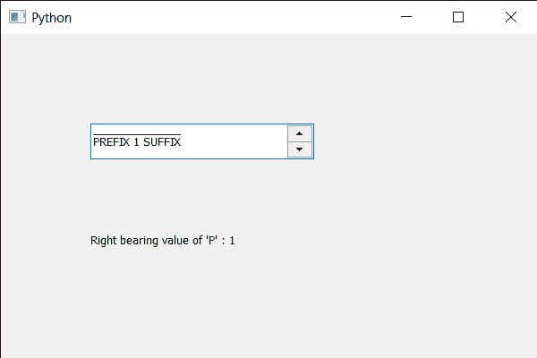

# PyQt5 QSpinBox–获取文本的正确方位值

> 原文:[https://www . geeksforgeeks . org/pyqt5-qspinbox-get-right-beating-value-the-text/](https://www.geeksforgeeks.org/pyqt5-qspinbox-getting-right-bearing-value-of-the-text/)

在本文中，我们将看到如何从旋转框的文本中获得给定字符的正确方位值。右方位是字符最右边像素从后续字符的逻辑原点向左的距离。如果字符的像素延伸到字符宽度的右侧，则该值为负。

为了做到这一点，我们对旋转框的 QFontMetrics 对象使用`rightBearing`方法。

> **语法:**font _ metrics . right bearing(ch)
> 
> **自变量:**以字符串为自变量
> 
> **返回:**返回整数。

下面是实现

```
# importing libraries
from PyQt5.QtWidgets import * 
from PyQt5 import QtCore, QtGui
from PyQt5.QtGui import * 
from PyQt5.QtCore import * 
import sys

class Window(QMainWindow):

    def __init__(self):
        super().__init__()

        # setting title
        self.setWindowTitle("Python ")

        # setting geometry
        self.setGeometry(100, 100, 600, 400)

        # calling method
        self.UiComponents()

        # showing all the widgets
        self.show()

        # method for widgets
    def UiComponents(self):
        # creating spin box
        self.spin = QSpinBox(self)

        # setting geometry to spin box
        self.spin.setGeometry(100, 100, 250, 40)

        # setting range to the spin box
        self.spin.setRange(1, 999999)

        # setting prefix to spin
        self.spin.setPrefix("PREFIX ")

        # setting suffix to spin
        self.spin.setSuffix(" SUFFIX")

        # setting over line to the font
        font = self.spin.font()
        font.setOverline(True)
        self.spin.setFont(font)

        # creating a label
        label = QLabel(self)

        # making label multi line
        label.setWordWrap(True)

        # setting geometry to the label
        label.setGeometry(100, 200, 300, 60)

        # getting font metrics
        f_metrics = self.spin.fontMetrics()

        # getting right bearing value of the character
        value = f_metrics.rightBearing('P')

        # setting text to the label
        label.setText("Right bearing value of 'P' : " + str(value))

# create pyqt5 app
App = QApplication(sys.argv)

# create the instance of our Window
window = Window()

# start the app
sys.exit(App.exec())
```

**输出:**
