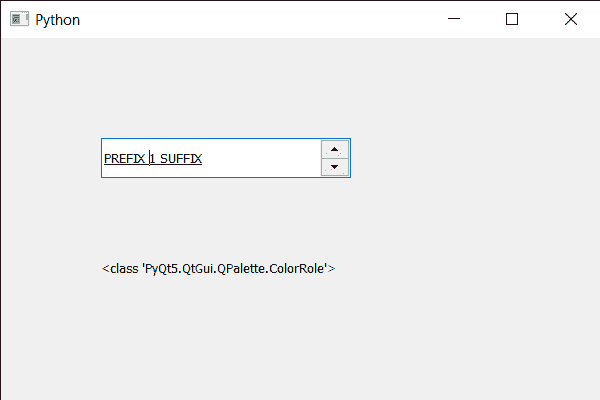

# PyQt5 QSpinBox–获取前台角色

> 原文:[https://www . geeksforgeeks . org/pyqt 5-qspinbox-get-the-前台-角色/](https://www.geeksforgeeks.org/pyqt5-qspinbox-getting-the-foreground-role/)

在本文中，我们将看到如何获得旋转框的前台角色，旋转框中基本上有两种类型的角色，一种是前台，另一种是后台。前景角色定义小部件调色板中用于绘制前景的颜色。如果旋转框中没有设置明确的前景角色，则前景角色将与背景角色形成对比。

为了做到这一点，我们对旋转框对象使用`foregroundRole`方法。

> **语法:** font_metrics.foregroundRole()
> 
> **论证:**不需要论证
> 
> **返回:**返回 ColorRole 对象

下面是实现

```py
# importing libraries
from PyQt5.QtWidgets import * 
from PyQt5 import QtCore, QtGui
from PyQt5.QtGui import * 
from PyQt5.QtCore import * 
import sys

class Window(QMainWindow):

    def __init__(self):
        super().__init__()

        # setting title
        self.setWindowTitle("Python ")

        # setting geometry
        self.setGeometry(100, 100, 600, 400)

        # calling method
        self.UiComponents()

        # showing all the widgets
        self.show()

        # method for widgets
    def UiComponents(self):
        # creating spin box
        self.spin = QSpinBox(self)

        # setting geometry to spin box
        self.spin.setGeometry(100, 100, 250, 40)

        # setting range to the spin box
        self.spin.setRange(1, 999999)

        # setting prefix to spin
        self.spin.setPrefix("PREFIX ")

        # setting suffix to spin
        self.spin.setSuffix(" SUFFIX")

        # setting under line to the font
        font = self.spin.font()
        font.setUnderline(True)
        self.spin.setFont(font)

        # creating a label
        label = QLabel(self)

        # making label multi line
        label.setWordWrap(True)

        # setting geometry to the label
        label.setGeometry(100, 200, 300, 60)

        # getting the foreground role object
        foreground = self.spin.foregroundRole()

        # setting text to the label
        label.setText(str(type(foreground)))

# create pyqt5 app
App = QApplication(sys.argv)

# create the instance of our Window
window = Window()

# start the app
sys.exit(App.exec())
```

**输出:**
