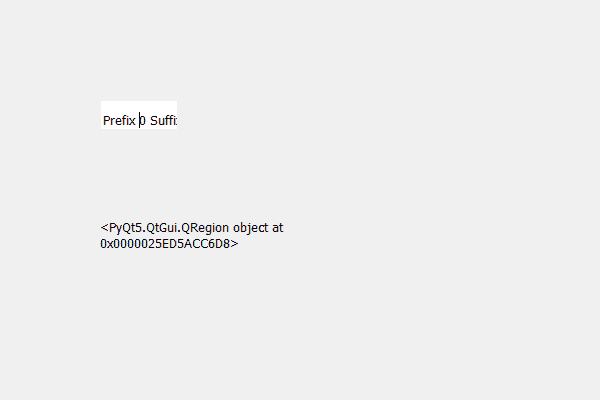

# PyQt5 QSpinBox–获取蒙版

> 原文:[https://www . geeksforgeeks . org/pyqt 5-qspinbox-get-the-mask/](https://www.geeksforgeeks.org/pyqt5-qspinbox-getting-the-mask/)

在本文中我们将看到我们如何可以获得旋转框的蒙版，蒙版基本上都是用来隐藏旋转框的，借助蒙版用户将无法看到整个旋转框虽然旋转框仍然会存在但上面会有蒙版。借助`setMask`方法可以将蒙版设置到旋转框中。

为了得到面具我们使用`mask`方法。

> **语法:**自旋 _box.mask()
> 
> **论证:**不需要论证
> 
> **返回:**返回 QRegion 对象

下面是实现

```
# importing libraries
from PyQt5.QtWidgets import * 
from PyQt5 import QtCore, QtGui
from PyQt5.QtGui import * 
from PyQt5.QtCore import * 
import sys

class Window(QMainWindow):

    def __init__(self):
        super().__init__()

        # setting title
        self.setWindowTitle("Python ")

        # setting geometry
        self.setGeometry(100, 100, 600, 400)

        # calling method
        self.UiComponents()

        # showing all the widgets
        self.show()

        # method for widgets
    def UiComponents(self):
        # creating spin box
        self.spin = QSpinBox(self)

        # setting geometry to spin box
        self.spin.setGeometry(100, 100, 250, 40)

        # setting range to the spin box
        self.spin.setRange(0, 999999)

        # setting prefix to spin
        self.spin.setPrefix("Prefix ")

        # setting suffix to spin
        self.spin.setSuffix(" Suffix")

        # getting the region of children of spin box
        region = self.spin.childrenRegion()

        # setting mask
        self.spin.setMask(region)

        # creating label
        label = QLabel(self)

        # setting geometry to the label
        label.setGeometry(100, 200, 200, 70)

        # making it multi line label
        label.setWordWrap(True)

        # getting mask
        mask = self.spin.mask()

        # setting to the label
        label.setText(str(mask))

# create pyqt5 app
App = QApplication(sys.argv)

# create the instance of our Window
window = Window()
window.spin.setFocus()
# start the app
sys.exit(App.exec())
```

**输出:**
