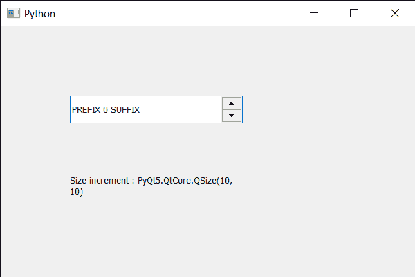

# PyQt5 QSpinBox–获取尺寸增量

> 原文:[https://www . geesforgeks . org/pyqt5-qspinbox-get-size-increment/](https://www.geeksforgeeks.org/pyqt5-qspinbox-getting-the-size-increment/)

在本文中，我们将了解如何获得旋转框的大小增量值。当旋转框大小随主窗口大小变化时，使用大小增量。如果旋转框定义了大小增量，则基本大小用于计算适当的旋转框大小。默认情况下，对于新创建的旋转框，此属性包含宽度和高度为零的大小。我们可以借助`setSizeIncrement`方法设置尺寸增量值。

下面是当主窗口变大时获得新旋转框大小的公式。

```py
width = baseSize().width() + i * sizeIncrement().width()
height = baseSize().height() + j * sizeIncrement().height()

Here i, j are the size increment in the main window

```

为了做到这一点，我们对旋转框对象使用`sizeIncrement`方法。

> **语法:**自旋 _box.sizeIncrement()
> 
> **论证:**不需要论证
> 
> **返回:**返回 QSize 对象

下面是实现

```py
# importing libraries
from PyQt5.QtWidgets import * 
from PyQt5 import QtCore, QtGui
from PyQt5.QtGui import * 
from PyQt5.QtCore import * 
import sys

class Window(QMainWindow):

    def __init__(self):
        super().__init__()

        # setting title
        self.setWindowTitle("Python ")

        # setting geometry
        self.setGeometry(100, 100, 600, 400)

        # calling method
        self.UiComponents()

        # showing all the widgets
        self.show()

        # method for widgets
    def UiComponents(self):
        # creating spin box
        self.spin = QSpinBox(self)

        # setting geometry to spin box
        self.spin.setGeometry(100, 100, 250, 40)

        # setting range to the spin box
        self.spin.setRange(0, 9)

        # setting prefix to spin
        self.spin.setPrefix("PREFIX ")

        # setting suffix to spin
        self.spin.setSuffix(" SUFFIX")

        # setting size increment
        self.spin.setSizeIncrement(10, 10)

        # creating a label
        self.label = QLabel(self)

        # making label multi line
        self.label.setWordWrap(True)

        # setting label geometry
        self.label.setGeometry(100, 200, 250, 60)

        # getting the size increment value
        value = self.spin.sizeIncrement()

        # setting text to the label
        self.label.setText("Size increment : " + str(value))

# create pyqt5 app
App = QApplication(sys.argv)

# create the instance of our Window
window = Window()

# start the app
sys.exit(App.exec())
```

输出:
