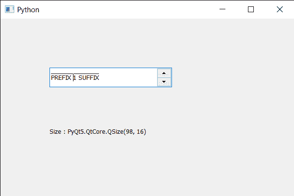

# PyQt5 QSpinBox–获取字体大小

> 原文:[https://www . geesforgeks . org/pyqt5-qspinbox-get-the-size-the-font/](https://www.geeksforgeeks.org/pyqt5-qspinbox-getting-the-size-of-the-font/)

在本文中，我们将看到如何获得旋转框的字体大小，即文本。为了得到尺寸对象，我们必须得到尺寸框的 QFontMetrics 对象来得到尺寸。大小将以像素为单位。

为了做到这一点，我们对旋转框的 QFontMetrics 对象使用`size`方法。

> **语法:** font_metrics.size(0，文本)
> 
> **参数:**需要两个参数，一个是引用标志的整数值，例如 0 代表单行文本，第二个是旋转框文本。
> 
> **返回:**返回 QSize 对象。

下面是实现

```
# importing libraries
from PyQt5.QtWidgets import * 
from PyQt5 import QtCore, QtGui
from PyQt5.QtGui import * 
from PyQt5.QtCore import * 
import sys

class Window(QMainWindow):

    def __init__(self):
        super().__init__()

        # setting title
        self.setWindowTitle("Python ")

        # setting geometry
        self.setGeometry(100, 100, 600, 400)

        # calling method
        self.UiComponents()

        # showing all the widgets
        self.show()

        # method for widgets
    def UiComponents(self):
        # creating spin box
        self.spin = QSpinBox(self)

        # setting geometry to spin box
        self.spin.setGeometry(100, 100, 250, 40)

        # setting range to the spin box
        self.spin.setRange(1, 999999)

        # setting prefix to spin
        self.spin.setPrefix("PREFIX ")

        # setting suffix to spin
        self.spin.setSuffix(" SUFFIX")

        # setting over line to the font
        font = self.spin.font()
        font.setOverline(True)
        self.spin.setFont(font)

        # creating a label
        label = QLabel(self)

        # making label multi line
        label.setWordWrap(True)

        # setting geometry to the label
        label.setGeometry(100, 200, 300, 60)

        # getting font metrics
        f_metrics = self.spin.fontMetrics()

        # text
        text = self.spin.text()

        # getting the size object
        value = f_metrics.size(0, text)

        # setting text to the label
        label.setText("Size : " + str(value))

# create pyqt5 app
App = QApplication(sys.argv)

# create the instance of our Window
window = Window()

# start the app
sys.exit(App.exec())
```

**输出:**
