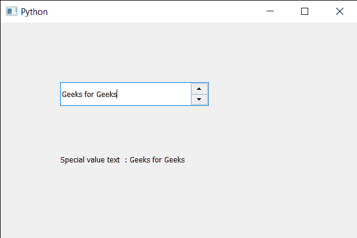

# PyQt5 QSpinBox–获取特殊值文本

> 原文:[https://www . geesforgeks . org/pyqt5-qspinbox-get-the-special-value-text/](https://www.geeksforgeeks.org/pyqt5-qspinbox-getting-the-special-value-text/)

在本文中，我们将看到如何获得旋转框的特殊值文本。默认情况下，没有特殊值文本，但通过将特殊值文本设置为数字，只要当前值等于最小值，数字框就会显示该特殊文本，而不是数值。这种情况的典型用法是表示这种选择具有特殊(默认)的含义。借助`setSpecialValueText`方法可以设置特殊值文本。

为了做到这一点，我们对旋转框对象使用`specialValueText`方法。

> **语法:**旋转框
> 
> **论证:**不需要论证
> 
> **返回:**返回字符串

下面是实现

```
# importing libraries
from PyQt5.QtWidgets import * 
from PyQt5 import QtCore, QtGui
from PyQt5.QtGui import * 
from PyQt5.QtCore import * 
import sys

class Window(QMainWindow):

    def __init__(self):
        super().__init__()

        # setting title
        self.setWindowTitle("Python ")

        # setting geometry
        self.setGeometry(100, 100, 600, 400)

        # calling method
        self.UiComponents()

        # showing all the widgets
        self.show()

        # method for widgets
    def UiComponents(self):
        # creating spin box
        self.spin = QSpinBox(self)

        # setting geometry to spin box
        self.spin.setGeometry(100, 100, 250, 40)

        # setting range to the spin box
        self.spin.setRange(0, 999999)

        # setting prefix to spin
        self.spin.setPrefix("PREFIX ")

        # setting suffix to spin
        self.spin.setSuffix(" SUFFIX")

        # setting special value text
        self.spin.setSpecialValueText("Geeks for Geeks")

        # setting status tip to the spin box
        self.spin.setStatusTip("Small Value")

        # creating a label
        self.label = QLabel(self)

        # making label multi line
        self.label.setWordWrap(True)

        # setting label geometry
        self.label.setGeometry(100, 200, 250, 60)

        # getting special value text
        value = self.spin.specialValueText()

        # setting text to the label
        self.label.setText("Special value text  : " + str(value))

# create pyqt5 app
App = QApplication(sys.argv)

# create the instance of our Window
window = Window()

# start the app
sys.exit(App.exec())
```

**输出:**
