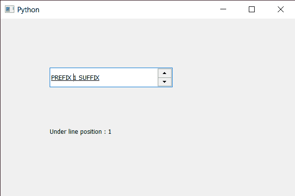

# PyQt5 QSpinBox–获取线下位置

> 原文:[https://www . geesforgeks . org/pyqt5-qspinbox-get-the-under-line-position/](https://www.geeksforgeeks.org/pyqt5-qspinbox-getting-the-under-line-position/)

在本文中，我们将看到如何获得旋转框文本的线下位置。底线位置是从基线到应该画底线的地方的距离。下划线，也称为下划线，是书写部分正下方或多或少的水平线。手写或打字文档中使用单下划线和偶尔使用双下划线来强调关键文本。

为了做到这一点，我们对旋转框的 QFontMetrics 对象使用`strikeOutPos`方法。

> **语法:**font _ metrics . underbolts()
> 
> **论证:**不需要论证
> 
> **返回:**返回整数。

下面是实现

```
# importing libraries
from PyQt5.QtWidgets import * 
from PyQt5 import QtCore, QtGui
from PyQt5.QtGui import * 
from PyQt5.QtCore import * 
import sys

class Window(QMainWindow):

    def __init__(self):
        super().__init__()

        # setting title
        self.setWindowTitle("Python ")

        # setting geometry
        self.setGeometry(100, 100, 600, 400)

        # calling method
        self.UiComponents()

        # showing all the widgets
        self.show()

        # method for widgets
    def UiComponents(self):
        # creating spin box
        self.spin = QSpinBox(self)

        # setting geometry to spin box
        self.spin.setGeometry(100, 100, 250, 40)

        # setting range to the spin box
        self.spin.setRange(1, 999999)

        # setting prefix to spin
        self.spin.setPrefix("PREFIX ")

        # setting suffix to spin
        self.spin.setSuffix(" SUFFIX")

        # setting under line to the font
        font = self.spin.font()
        font.setUnderline(True)
        self.spin.setFont(font)

        # creating a label
        label = QLabel(self)

        # making label multi line
        label.setWordWrap(True)

        # setting geometry to the label
        label.setGeometry(100, 200, 300, 60)

        # getting font metrics
        f_metrics = self.spin.fontMetrics()

        # getting the under line position
        value = f_metrics.underlinePos()

        # setting text to the label
        label.setText("Under line position : " + str(value))

# create pyqt5 app
App = QApplication(sys.argv)

# create the instance of our Window
window = Window()

# start the app
sys.exit(App.exec())
```

**输出:**
