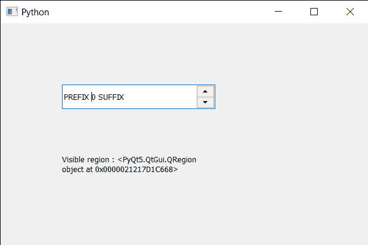

# PyQt5 QSpinBox–获取可见区域

> 原文:[https://www . geesforgeks . org/pyqt 5-qspinbox-get-the-visible-region/](https://www.geeksforgeeks.org/pyqt5-qspinbox-getting-the-visible-region/)

在本文中，我们将了解如何获得旋转框的可见区域。旋转框的可见区域是可以发生绘画事件的未遮挡区域。对于可见的旋转框，这是其他小部件没有覆盖的区域的近似值，否则这是一个空白区域。

为了做到这一点，我们对旋转框对象使用`visibleRegion`方法。

> **语法:**自旋 _box.visibleRegion()
> 
> **论证:**不需要论证
> 
> **返回:**返回 QRegion 对象

下面是实现

```py
# importing libraries
from PyQt5.QtWidgets import * 
from PyQt5 import QtCore, QtGui
from PyQt5.QtGui import * 
from PyQt5.QtCore import * 
import sys

class Window(QMainWindow):

    def __init__(self):
        super().__init__()

        # setting title
        self.setWindowTitle("Python ")

        # setting geometry
        self.setGeometry(100, 100, 600, 400)

        # calling method
        self.UiComponents()

        # showing all the widgets
        self.show()

        # method for widgets
    def UiComponents(self):
        # creating spin box
        self.spin = QSpinBox(self)

        # setting geometry to spin box
        self.spin.setGeometry(100, 100, 250, 40)

        # setting range to the spin box
        self.spin.setRange(0, 999999)

        # setting prefix to spin
        self.spin.setPrefix("PREFIX ")

        # setting suffix to spin
        self.spin.setSuffix(" SUFFIX")

        # setting status tip to the spin box
        self.spin.setStatusTip("Small Value")

        # creating a label
        self.label = QLabel(self)

        # making label multi line
        self.label.setWordWrap(True)

        # setting label geometry
        self.label.setGeometry(100, 200, 250, 60)

        # getting the visible region
        value = self.spin.visibleRegion()

        # setting text to the label
        self.label.setText("Visible region : " + str(value))

# create pyqt5 app
App = QApplication(sys.argv)

# create the instance of our Window
window = Window()

# start the app
sys.exit(App.exec())
```

**输出:**
