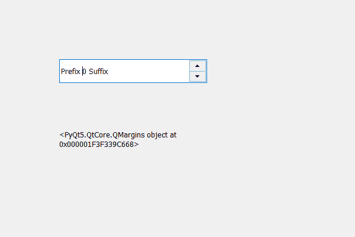

# PyQt5 QSpinBox–如何获取内容边距

> 原文:[https://www . geesforgeks . org/pyqt 5-qspinbox-如何获取内容-页边距/](https://www.geeksforgeeks.org/pyqt5-qspinbox-how-to-get-content-margins/)

在本文中，我们将看到如何获得旋转框的内容边距，内容边距是内容和外部边框之间的边距。默认情况下，每个边的旋转框内容边距设置为 0，尽管我们可以使用`setContentsMargins`方法进行更改。

为此，我们使用 **contentsMargins** 方法。

> **语法:** spin_box.contentsMargins()
> 
> **论证:**不需要论证
> 
> **返回:**返回 QMargin 对象

下面是实现

```
# importing libraries
from PyQt5.QtWidgets import * 
from PyQt5 import QtCore, QtGui
from PyQt5.QtGui import * 
from PyQt5.QtCore import * 
import sys

class Window(QMainWindow):

    def __init__(self):
        super().__init__()

        # setting title
        self.setWindowTitle("Python ")

        # setting geometry
        self.setGeometry(100, 100, 600, 400)

        # calling method
        self.UiComponents()

        # showing all the widgets
        self.show()

        # method for widgets
    def UiComponents(self):
        # creating spin box
        self.spin = QSpinBox(self)

        # setting geometry to spin box
        self.spin.setGeometry(100, 100, 250, 40)

        # setting range to the spin box
        self.spin.setRange(0, 999999)

        # setting prefix to spin
        self.spin.setPrefix("Prefix ")

        # setting suffix to spin
        self.spin.setSuffix(" Suffix")

        # creating label
        label = QLabel(self)

        # setting geometry to the label
        label.setGeometry(100, 200, 200, 70)

        # making it multi line label
        label.setWordWrap(True)

        # getting content margins
        margin = self.spin.contentsMargins()

        # setting text to the label
        label.setText(str(margin))

# create pyqt5 app
App = QApplication(sys.argv)

# create the instance of our Window
window = Window()
window.spin.setFocus()
# start the app
sys.exit(App.exec())
```

**输出:**
