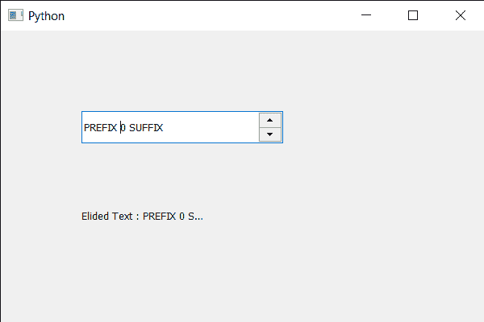

# PyQt5 QSpinBox–如何通过字体

获取省略文本

> 原文:[https://www . geeksforgeeks . org/pyqt 5-qspinbox-如何通过字体获取省略文本/](https://www.geeksforgeeks.org/pyqt5-qspinbox-how-to-get-the-elided-text-through-font/)

在本文中，我们将看到如何获得旋转框的省略文本。如果字符串文本比宽度宽，则省略版本的字符串将是包含“…”的字符串。否则，将显示原始字符串。

有三个模式参数可以获得省略的文本。模式参数指定文本是在左侧(例如“…tech”)、中间(例如“Tr…ch”)还是在右侧(例如“Trol…”)被省略。

为了做到这一点，我们对旋转框的 QFontMetrics 对象使用`elidedText`方法。

> **语法:**font _ metrics . elided text(text，Qt。ElideRight，80)
> 
> **参数:**需要 3 个参数，第一个是旋转框文本，第二个是 elide 模式，第三个是以像素为单位的宽度。
> 
> **返回:**返回无

下面是实现

```
# importing libraries
from PyQt5.QtWidgets import * 
from PyQt5 import QtCore, QtGui
from PyQt5.QtGui import * 
from PyQt5.QtCore import * 
import sys

class Window(QMainWindow):

    def __init__(self):
        super().__init__()

        # setting title
        self.setWindowTitle("Python ")

        # setting geometry
        self.setGeometry(100, 100, 600, 400)

        # calling method
        self.UiComponents()

        # showing all the widgets
        self.show()

        # method for widgets
    def UiComponents(self):
        # creating spin box
        self.spin = QSpinBox(self)

        # setting geometry to spin box
        self.spin.setGeometry(100, 100, 250, 40)

        # setting range to the spin box
        self.spin.setRange(0, 999999)

        # setting prefix to spin
        self.spin.setPrefix("PREFIX ")

        # setting suffix to spin
        self.spin.setSuffix(" SUFFIX")

        # creating a label
        label = QLabel(self)

        # making label multi line
        label.setWordWrap(True)

        # setting geometry to the label
        label.setGeometry(100, 200, 300, 60)

        # getting font metrics
        f_metrics = self.spin.fontMetrics()

        # text
        text = self.spin.text()

        # getting elided text
        elided_text = f_metrics.elidedText(text, Qt.ElideRight, 80)

        # setting text to the label
        label.setText("Elided Text : " + str(elided_text))

# create pyqt5 app
App = QApplication(sys.argv)

# create the instance of our Window
window = Window()

# start the app
sys.exit(App.exec())
```

**输出:**
