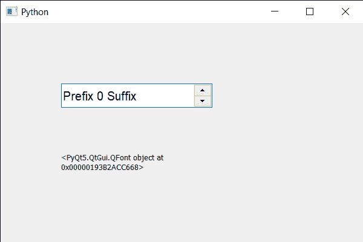

# PyQt5 QSpinBox–如何获取旋转框的字体

> 原文:[https://www . geeksforgeeks . org/pyqt5-qspinbox-如何获得旋转盒字体/](https://www.geeksforgeeks.org/pyqt5-qspinbox-how-to-get-the-font-of-spin-box/)

在本文中，我们将看到如何获得旋转框中所有文本的字体，为了设置字体，使用以`QFont`对象为参数的`setFont`方法，将其与旋转框对象一起使用将改变所有文本的字体。

> 为了得到字体，我们使用字体方法
> 
> **语法:** spin_box.font()
> 
> **论证:**不需要论证
> 
> **返回:**返回 QFont 对象

下面是实现

```py
# importing libraries
from PyQt5.QtWidgets import * 
from PyQt5 import QtCore, QtGui
from PyQt5.QtGui import * 
from PyQt5.QtCore import * 
import sys

class Window(QMainWindow):

    def __init__(self):
        super().__init__()

        # setting title
        self.setWindowTitle("Python ")

        # setting geometry
        self.setGeometry(100, 100, 600, 400)

        # calling method
        self.UiComponents()

        # showing all the widgets
        self.show()

        # method for widgets
    def UiComponents(self):
        # creating spin box
        self.spin = QSpinBox(self)

        # setting geometry to spin box
        self.spin.setGeometry(100, 100, 250, 40)

        # setting range to the spin box
        self.spin.setRange(0, 999999)

        # setting prefix to spin
        self.spin.setPrefix("Prefix ")

        # setting suffix to spin
        self.spin.setSuffix(" Suffix")

        # setting font to the spin box
        self.spin.setFont(QFont('Arial', 12))

        # creating a label
        label = QLabel(self)

        # making it multi line
        label.setWordWrap(True)

        # setting its geometry
        label.setGeometry(100, 200, 200, 60)

        # getting font of spin box
        font = self.spin.font()

        # setting text to the label
        label.setText(str(font))

# create pyqt5 app
App = QApplication(sys.argv)

# create the instance of our Window
window = Window()

# start the app
sys.exit(App.exec())
```

**输出:**
