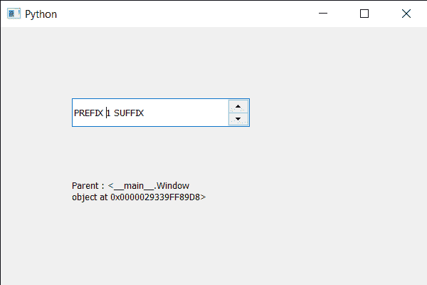

# PyQt5 QSpinBox–如何获取父代

> 原文:[https://www . geesforgeks . org/pyqt 5-qspinbox-如何找到家长/](https://www.geeksforgeeks.org/pyqt5-qspinbox-how-to-get-the-parent/)

在本文中，我们将看到如何获得旋转框的父元素。每个小部件都有一些父部件，例如旋转框的子部件是线编辑，线编辑父部件将是旋转框本身。

为了做到这一点，我们对旋转框对象使用`parent`方法。

> **语法:**自旋 _box.parent()
> 
> **论证:**不需要论证
> 
> **返回:**返回父对象

下面是实现

```py
# importing libraries
from PyQt5.QtWidgets import * 
from PyQt5 import QtCore, QtGui
from PyQt5.QtGui import * 
from PyQt5.QtCore import * 
import sys

class Window(QMainWindow):

    def __init__(self):
        super().__init__()

        # setting title
        self.setWindowTitle("Python ")

        # setting geometry
        self.setGeometry(100, 100, 600, 400)

        # calling method
        self.UiComponents()

        # showing all the widgets
        self.show()

        # method for widgets
    def UiComponents(self):
        # creating spin box
        self.spin = QSpinBox(self)

        # setting geometry to spin box
        self.spin.setGeometry(100, 100, 250, 40)

        # setting range to the spin box
        self.spin.setRange(1, 999999)

        # setting prefix to spin
        self.spin.setPrefix("PREFIX ")

        # setting suffix to spin
        self.spin.setSuffix(" SUFFIX")

        # creating a label
        label = QLabel(self)

        # making the label multi line
        label.setWordWrap(True)

        # setting geometry to the label
        label.setGeometry(100, 200, 200, 60)

        # getting parent
        value = self.spin.parent()

        # setting text to the label
        label.setText("Parent : " + str(value))

# create pyqt5 app
App = QApplication(sys.argv)

# create the instance of our Window
window = Window()

# start the app
sys.exit(App.exec())
```

**输出:**
