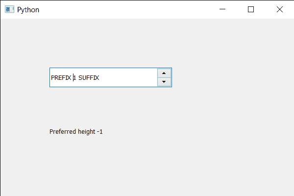

# PyQt5 QSpinBox–如何获得给定宽度的首选高度

> 原文:[https://www . geesforgeks . org/pyqt5-qspinbox-如何获得给定宽度的首选高度/](https://www.geeksforgeeks.org/pyqt5-qspinbox-how-to-get-the-preferred-height-for-the-given-width/)

在本文中，我们将看到如何根据宽度获得旋转框的首选高度。取决于宽度的高度意味着当宽度改变时，高度也随之改变。默认情况下，高度不取决于宽度。

**注意:**如果旋转框有布局，默认实现返回布局的首选高度。如果没有布局，默认实现返回-1，表示首选高度不依赖于宽度。

为了做到这一点，我们对旋转框对象使用`heightForWidth`方法。

> **语法:**旋转框。高度前进(宽度)
> 
> **自变量:**以整数为自变量
> 
> **返回:**返回整数

下面是实现

```py
# importing libraries
from PyQt5.QtWidgets import * 
from PyQt5 import QtCore, QtGui
from PyQt5.QtGui import * 
from PyQt5.QtCore import * 
import sys

class Window(QMainWindow):

    def __init__(self):
        super().__init__()

        # setting title
        self.setWindowTitle("Python ")

        # setting geometry
        self.setGeometry(100, 100, 600, 400)

        # calling method
        self.UiComponents()

        # showing all the widgets
        self.show()

        # method for widgets
    def UiComponents(self):
        # creating spin box
        self.spin = QSpinBox(self)

        # setting geometry to spin box
        self.spin.setGeometry(100, 100, 250, 40)

        # setting range to the spin box
        self.spin.setRange(1, 999999)

        # setting prefix to spin
        self.spin.setPrefix("PREFIX ")

        # setting suffix to spin
        self.spin.setSuffix(" SUFFIX")

        # creating a label
        label = QLabel(self)

        # making the label multi line
        label.setWordWrap(True)

        # setting geometry to the label
        label.setGeometry(100, 200, 200, 60)

        # getting preferred height of the spin box with current width
        value = self.spin.heightForWidth(250)

        # setting text to the label
        label.setText("Preferred height " + str(value))

# create pyqt5 app
App = QApplication(sys.argv)

# create the instance of our Window
window = Window()

# start the app
sys.exit(App.exec())
```

**输出:**
