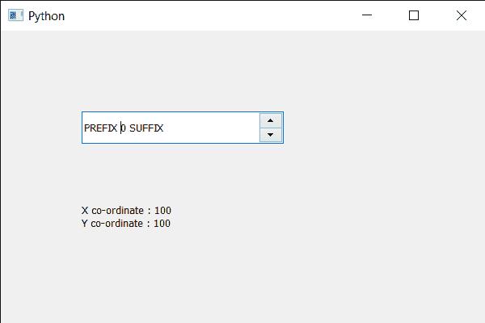

# PyQt5 QSpinBox–如何分别获取 X 和 Y 坐标

> 原文:[https://www . geeksforgeeks . org/pyqt5-qspinbox-如何分别获得 x 和 y 坐标/](https://www.geeksforgeeks.org/pyqt5-qspinbox-how-to-get-the-x-and-y-co-ordinates-respectively/)

在本文中，我们将了解如何获得旋转框的 X 和 Y 坐标。X 坐标是旋转框距窗框左侧的距离，Y 坐标是旋转框距窗框上侧的距离，利用 X 和 Y 坐标可以确定旋转框在窗户中的位置。

为此，我们对旋转框对象分别使用`x`和`y`方法。

> **语法:** spin_box.x()和 spin_box.y()
> 
> **论证:**不需要论证
> 
> **返回:**返回整数

下面是实现

```py
# importing libraries
from PyQt5.QtWidgets import * 
from PyQt5 import QtCore, QtGui
from PyQt5.QtGui import * 
from PyQt5.QtCore import * 
import sys

class Window(QMainWindow):

    def __init__(self):
        super().__init__()

        # setting title
        self.setWindowTitle("Python ")

        # setting geometry
        self.setGeometry(100, 100, 600, 400)

        # calling method
        self.UiComponents()

        # showing all the widgets
        self.show()

        # method for widgets
    def UiComponents(self):
        # creating spin box
        self.spin = QSpinBox(self)

        # setting geometry to spin box
        self.spin.setGeometry(100, 100, 250, 40)

        # setting range to the spin box
        self.spin.setRange(0, 9)

        # setting prefix to spin
        self.spin.setPrefix("PREFIX ")

        # setting suffix to spin
        self.spin.setSuffix(" SUFFIX")

        # creating a label
        self.label = QLabel(self)

        # making label multi line
        self.label.setWordWrap(True)

        # setting label geometry
        self.label.setGeometry(100, 200, 120, 60)

        # getting the X and Y co-ordinates
        x_value = self.spin.x()
        y_value = self.spin.y()

        # setting text to the label
        self.label.setText("X co-ordinate : " + str(x_value) +
                           " Y co-ordinate : " + str(y_value))

# create pyqt5 app
App = QApplication(sys.argv)

# create the instance of our Window
window = Window()

# start the app
sys.exit(App.exec())
```

**输出:**
