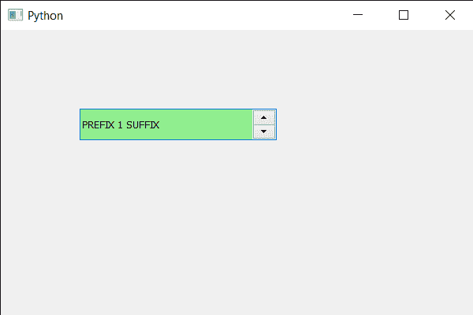

# PyQt5 QSpinBox–如何重新绘制

> 原文:[https://www . geesforgeks . org/pyqt 5-qspinbox-如何重新喷漆-it/](https://www.geeksforgeeks.org/pyqt5-qspinbox-how-to-repaint-it/)

在本文中，我们将看到如何重新绘制旋转框。在画师事件的帮助下，我们可以按照用户希望的方式绘制旋转框，但有时需要重新绘制旋转框以确保画师事件的动作。

为了做到这一点，我们对旋转框对象使用`repaint`方法。

> **语法:**旋转框.重画()
> 
> **论证:**不需要论证
> 
> **返回:**返回无

下面是实现

```py
# importing libraries
from PyQt5.QtWidgets import * 
from PyQt5 import QtCore, QtGui
from PyQt5.QtGui import * 
from PyQt5.QtCore import * 
import sys

class Window(QMainWindow):

    def __init__(self):
        super().__init__()

        # setting title
        self.setWindowTitle("Python ")

        # setting geometry
        self.setGeometry(100, 100, 600, 400)

        # calling method
        self.UiComponents()

        # showing all the widgets
        self.show()

        # method for widgets
    def UiComponents(self):
        # creating spin box
        self.spin = QSpinBox(self)

        # setting geometry to spin box
        self.spin.setGeometry(100, 100, 250, 40)

        # setting range to the spin box
        self.spin.setRange(1, 999999)

        # setting prefix to spin
        self.spin.setPrefix("PREFIX ")

        # setting suffix to spin
        self.spin.setSuffix(" SUFFIX")

        # setting background color to the spin box
        self.spin.setStyleSheet("QSpinBox"
                                "{"
                                "background : lightgreen;"
                                "}")

        # repaint the spin box
        self.spin.repaint()

# create pyqt5 app
App = QApplication(sys.argv)

# create the instance of our Window
window = Window()

# start the app
sys.exit(App.exec())
```

**输出:**
