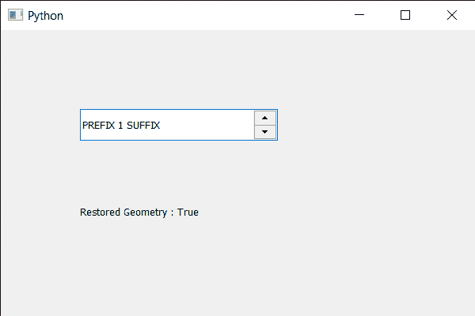

# PyQt5 QSpinBox–如何恢复几何图形

> 原文:[https://www . geesforgeks . org/pyqt 5-qspinbox-如何恢复几何/](https://www.geeksforgeeks.org/pyqt5-qspinbox-how-to-restore-geometry/)

在本文中，我们将看到如何从保存的中恢复旋转框的几何形状。保存几何有助于保存顶层旋转框小部件的当前几何和状态，这可以在`saveGeometry`的帮助下完成。保存数据可以存储在任何外部文件或任何变量中，也可以恢复为其他用途。

为了做到这一点，我们对旋转框对象使用`restoreGeometry`方法。

> **语法:**旋转框。恢复几何(字节数组)
> 
> **参数:**需要 QByteArray 对象参数
> 
> **返回:**返回布尔值，即成功为真，否则为假

下面是实现

```py
# importing libraries
from PyQt5.QtWidgets import * 
from PyQt5 import QtCore, QtGui
from PyQt5.QtGui import * 
from PyQt5.QtCore import * 
import sys

class Window(QMainWindow):

    def __init__(self):
        super().__init__()

        # setting title
        self.setWindowTitle("Python ")

        # setting geometry
        self.setGeometry(100, 100, 600, 400)

        # calling method
        self.UiComponents()

        # showing all the widgets
        self.show()

        # method for widgets
    def UiComponents(self):
        # creating spin box
        self.spin = QSpinBox(self)

        # setting geometry to spin box
        self.spin.setGeometry(100, 100, 250, 40)

        # setting range to the spin box
        self.spin.setRange(1, 999999)

        # setting prefix to spin
        self.spin.setPrefix("PREFIX ")

        # setting suffix to spin
        self.spin.setSuffix(" SUFFIX")

        # creating a label
        label = QLabel(self)

        # making the label multi line
        label.setWordWrap(True)

        # setting geometry to the label
        label.setGeometry(100, 200, 200, 60)

        # saving the geometry
        value = self.spin.saveGeometry()

        # changing the geometry
        self.spin.setGeometry(10, 10, 50, 50)

        # restoring the old geometry
        sucess = self.spin.restoreGeometry(value)

        # setting text to the label
        label.setText("Restored Geometry : " + str(sucess))

# create pyqt5 app
App = QApplication(sys.argv)

# create the instance of our Window
window = Window()

# start the app
sys.exit(App.exec())
```

**输出:**
