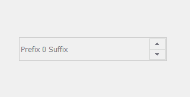

# PyQt5 QSpinBox–根据用户

将其禁用

> 原文:[https://www . geesforgeks . org/pyqt 5-qspinbox-making-it-disabled-根据用户/](https://www.geeksforgeeks.org/pyqt5-qspinbox-making-it-disabled-according-to-user/)

在这篇文章中，我们将看到如何根据用户禁用旋转框，禁用的旋转框基本上是不能编辑的旋转框，即被禁用的旋转框。下面是禁用的旋转框的外观。


为了做到这一点我们采用`setDisabled`法。

> **语法:** spin_box.setDisabled(bool)
> 
> **自变量:**它以布尔为自变量
> 
> **返回:**返回无

**实施步骤:**
1。创建旋转框
2。创建一个按钮
3。向按钮
4 添加动作。在操作中，禁用旋转框

下面是实现

```
# importing libraries
from PyQt5.QtWidgets import * 
from PyQt5 import QtCore, QtGui
from PyQt5.QtGui import * 
from PyQt5.QtCore import * 
import sys

class Window(QMainWindow):

    def __init__(self):
        super().__init__()

        # setting title
        self.setWindowTitle("Python ")

        # setting geometry
        self.setGeometry(100, 100, 600, 400)

        # calling method
        self.UiComponents()

        # showing all the widgets
        self.show()

    # method for widgets
    def UiComponents(self):

        # creating spin box
        self.spin = QSpinBox(self)

        # setting geometry to spin box
        self.spin.setGeometry(100, 100, 250, 40)

        # setting prefix to spin
        self.spin.setPrefix("Prefix ")

        # setting suffix to spin
        self.spin.setSuffix(" Suffix")

        # setting range to spin
        self.spin.setRange(0, 99999)

        # creating push button
        button = QPushButton("Press", self)

        # setting button geometry
        button.setGeometry(100, 160, 100, 40)

        # adding action to the push button
        button.clicked.connect(self.push_method)

    # method called by push button
    def push_method(self):

        # making spin box disabled
        self.spin.setDisabled(True)

# create pyqt5 app
App = QApplication(sys.argv)

# create the instance of our Window
window = Window()

# start the app
sys.exit(App.exec())
```

**输出:**

<video class="wp-video-shortcode" id="video-410672-1" width="640" height="428" preload="metadata" controls=""><source type="video/mp4" src="https://media.geeksforgeeks.org/wp-content/uploads/20200510002753/Python-10-05-2020-00_27_14.mp4?_=1">[https://media.geeksforgeeks.org/wp-content/uploads/20200510002753/Python-10-05-2020-00_27_14.mp4](https://media.geeksforgeeks.org/wp-content/uploads/20200510002753/Python-10-05-2020-00_27_14.mp4)</video>