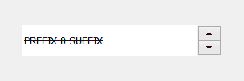
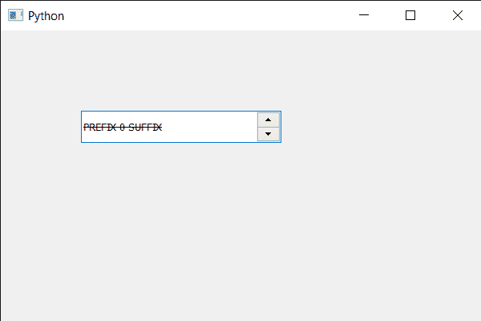

# PyQt5 QSpinBox–将文本删除

> 原文:[https://www . geesforgeks . org/pyqt5-qspinbox-making-text-strike-out/](https://www.geeksforgeeks.org/pyqt5-qspinbox-making-text-strike-out/)

在本文中，我们将了解如何使旋转框的文本突出显示。删除/贯穿是一种排印方式，用一条水平线穿过单词的中心，产生这样的文本。与经过审查或净化的文本相反，这些文字仍然可读。这个演示意味着两个意思之一。下面是旋转框的删除文本的样子。



为了做到这一点，我们对旋转框的 QFont 对象使用`setStrikeOut`方法。

> **语法:**字体.设置删除线(真)
> 
> **自变量:**它以布尔为自变量
> 
> **返回:**返回无

下面是实现

```py
# importing libraries
from PyQt5.QtWidgets import * 
from PyQt5 import QtCore, QtGui
from PyQt5.QtGui import * 
from PyQt5.QtCore import * 
import sys

class Window(QMainWindow):

    def __init__(self):
        super().__init__()

        # setting title
        self.setWindowTitle("Python ")

        # setting geometry
        self.setGeometry(100, 100, 600, 400)

        # calling method
        self.UiComponents()

        # showing all the widgets
        self.show()

        # method for widgets
    def UiComponents(self):
        # creating spin box
        self.spin = QSpinBox(self)

        # setting geometry to spin box
        self.spin.setGeometry(100, 100, 250, 40)

        # setting range to the spin box
        self.spin.setRange(0, 999999)

        # setting prefix to spin
        self.spin.setPrefix("PREFIX ")

        # setting suffix to spin
        self.spin.setSuffix(" SUFFIX")

        # getting font of the spin box
        font = self.spin.font()

        # setting strike out
        font.setStrikeOut(True)

        # reassigning this font to the spin box
        self.spin.setFont(font)

# create pyqt5 app
App = QApplication(sys.argv)

# create the instance of our Window
window = Window()

# start the app
sys.exit(App.exec())
```

**输出:**
