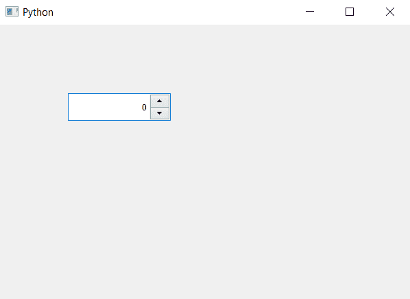

# PyQt5 QSpinBox–使数值显示在右侧

> 原文:[https://www . geeksforgeeks . org/pyqt 5-qspinbox-制作-价值展示-右侧/](https://www.geeksforgeeks.org/pyqt5-qspinbox-making-value-to-show-right-side/)

在本文中，我们将看到如何使值出现在旋转框的右侧，当我们创建旋转框时，值在左侧。为了使值在右侧，我们必须将其对齐标志设置为右侧。

为了做到这一点，我们将使用`setAlignment`方法。

> **语法:** spin_box.setAlignment(Qt。准星灯)
> 
> **自变量:**它以 Qt 对象为自变量
> 
> **返回:**返回无

下面是实现

```
# importing libraries
from PyQt5.QtWidgets import * 
from PyQt5 import QtCore, QtGui
from PyQt5.QtGui import * 
from PyQt5.QtCore import * 
import sys

class Window(QMainWindow):

    def __init__(self):
        super().__init__()

        # setting title
        self.setWindowTitle("Python ")

        # setting geometry
        self.setGeometry(100, 100, 600, 400)

        # calling method
        self.UiComponents()

        # showing all the widgets
        self.show()

    # method for widgets
    def UiComponents(self):

        # creating spin box
        self.spin = QSpinBox(self)

        # setting geometry to spin box
        self.spin.setGeometry(100, 100, 150, 40)

        # right flag
        right = Qt.AlignRight

        # setting alignment
        self.spin.setAlignment(right)

# create pyqt5 app
App = QApplication(sys.argv)

# create the instance of our Window
window = Window()

# start the app
sys.exit(App.exec())
```

**输出:**
