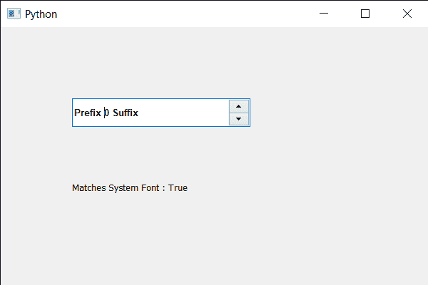

# PyQt5 QSpinBox–将字体与系统字体匹配

> 原文:[https://www . geesforgeks . org/pyqt5-qspinbox-matching-font-with-system-font/](https://www.geeksforgeeks.org/pyqt5-qspinbox-matching-font-with-the-system-font/)

在本文中，我们将看到如何将旋转框的字体与系统字体相匹配，字体匹配意味着它与系统字体相似。借助`font`方法可以得到旋转框的 QFont 对象。

**注意:**将文字变成斜体或加粗并不代表字体发生了变化，默认系统有 Arial 字体。如果我们从 Arial 设置不同的字体，那么它将返回 False 输出，因为它们不匹配。

> 为了做到这一点，我们对旋转框的 QFont 对象使用 exactMatch 方法
> 
> **语法:** font.exactMatch()
> 
> **论证:**不需要论证
> 
> **返回:**返回 bool

下面是实现

```
# importing libraries
from PyQt5.QtWidgets import * 
from PyQt5 import QtCore, QtGui
from PyQt5.QtGui import * 
from PyQt5.QtCore import * 
import sys

class Window(QMainWindow):

    def __init__(self):
        super().__init__()

        # setting title
        self.setWindowTitle("Python ")

        # setting geometry
        self.setGeometry(100, 100, 600, 400)

        # calling method
        self.UiComponents()

        # showing all the widgets
        self.show()

        # method for widgets
    def UiComponents(self):
        # creating spin box
        self.spin = QSpinBox(self)

        # setting geometry to spin box
        self.spin.setGeometry(100, 100, 250, 40)

        # setting range to the spin box
        self.spin.setRange(0, 999999)

        # setting prefix to spin
        self.spin.setPrefix("Prefix ")

        # setting suffix to spin
        self.spin.setSuffix(" Suffix")

        # getting font of the spin box
        font = QFont('Arial')

        # making font bold
        font.setBold(True)

        # setting this font to the spin box
        self.spin.setFont(font)

        # checking if font matches with the system font
        match = font.exactMatch()

        # creating a label
        label = QLabel(self)

        # setting geometry to the label
        label.setGeometry(100, 200, 300, 50)

        # setting text to the label
        label.setText("Matches System Font : " + str(match))

# create pyqt5 app
App = QApplication(sys.argv)

# create the instance of our Window
window = Window()

# start the app
sys.exit(App.exec())
```

**输出:**
