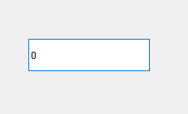
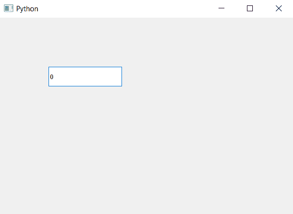

# PyQt5 QSpinBox–移除箭头按钮

> 原文:[https://www . geesforgeks . org/pyqt5-qspinbox-移除箭头按钮/](https://www.geeksforgeeks.org/pyqt5-qspinbox-removing-the-arrow-buttons/)

在本文中，我们将看到如何移除旋转框的按钮，基本上旋转框中有两个按钮，一个用于增加值，第二个用于减少值。下面是普通旋转框与无按钮旋转框的对比图

为了做到这一点，我们将使用`setButtonSymbols`方法。
 

> **语法:**
> 自旋盒。按钮)
> 或
> 旋转框。设置按钮符号(2)
> 
> **参数:**取 QAbstractSpinBox 对象或整数值
> 
> **返回:**无

下面是实现

```py
# importing libraries
from PyQt5.QtWidgets import * 
from PyQt5 import QtCore, QtGui
from PyQt5.QtGui import * 
from PyQt5.QtCore import * 
import sys

class Window(QMainWindow):

    def __init__(self):
        super().__init__()

        # setting title
        self.setWindowTitle("Python ")

        # setting geometry
        self.setGeometry(100, 100, 600, 400)

        # calling method
        self.UiComponents()

        # showing all the widgets
        self.show()

    # method for widgets
    def UiComponents(self):

        # creating spin box
        self.spin = QSpinBox(self)

        # setting geometry to spin box
        self.spin.setGeometry(100, 100, 150, 40)

        # removing the buttons
        self.spin.setButtonSymbols(QAbstractSpinBox.NoButtons)

# create pyqt5 app
App = QApplication(sys.argv)

# create the instance of our Window
window = Window()

# start the app
sys.exit(App.exec())
```

**输出:**
