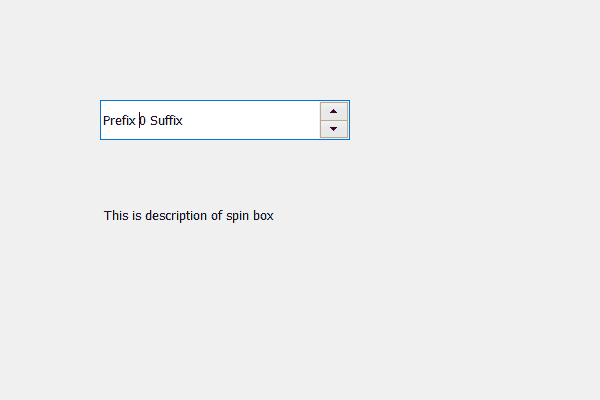

# PyQt5 QSpinBox–检索描述

> 原文:[https://www . geeksforgeeks . org/pyqt 5-qspinbox-retrieving-description/](https://www.geeksforgeeks.org/pyqt5-qspinbox-retrieving-description/)

在本文中，我们将看到如何获得旋转框的描述，描述是关于组合框的详细信息，它讲述了功能用例和其他主要信息，以了解旋转框的工作。程序员使用描述来更好地理解程序。`setAccessibleDescription`方法用于设置描述。

为此，我们使用了 accessibleDescription 方法。

> **语法:**自旋 _box.accessibleDescription()
> 
> **论证:**不需要论证
> 
> **返回:**返回无

下面是实现

```py
# importing libraries
from PyQt5.QtWidgets import * 
from PyQt5 import QtCore, QtGui
from PyQt5.QtGui import * 
from PyQt5.QtCore import * 
import sys

class Window(QMainWindow):

    def __init__(self):
        super().__init__()

        # setting title
        self.setWindowTitle("Python ")

        # setting geometry
        self.setGeometry(100, 100, 600, 400)

        # calling method
        self.UiComponents()

        # showing all the widgets
        self.show()

    # method for widgets
    def UiComponents(self):
        # creating spin box
        self.spin = QSpinBox(self)

        # setting geometry to spin box
        self.spin.setGeometry(100, 100, 250, 40)

        # setting prefix to spin
        self.spin.setPrefix("Prefix ")

        # setting suffix to spin
        self.spin.setSuffix(" Suffix")

        # text for description
        text = " This is description of spin box "

        # adding description ot the spin box
        self.spin.setAccessibleDescription(text)

        # creating a label
        label = QLabel(self)

        # getting the description
        des = self.spin.accessibleDescription()

        # setting text to the label
        label.setText(des)

        # setting geometry to the label
        label.setGeometry(100, 200, 300, 30)

# create pyqt5 app
App = QApplication(sys.argv)

# create the instance of our Window
window = Window()

# start the app
sys.exit(App.exec())
```

**输出:**
