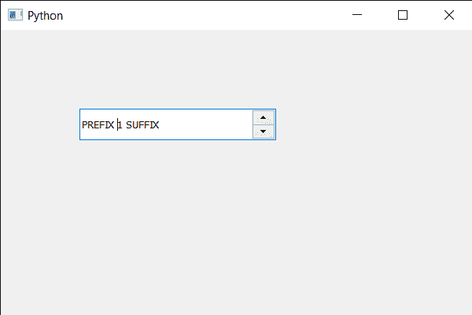

# pyqt 5 qscupbox–滚动它

> 哎哎哎:# t0]https://www . geeksforgeeks . org/pyqt 5-qspinbox-scroll-it/

在本文中，我们将看到如何滚动旋转框。滚动可以通过向右滚动像素和向下滚动像素来完成。滚动之后，小部件将接收需要重新绘制的区域的绘制事件。对于 Qt 知道是不透明的旋转盒，这只是新暴露的部分。例如，如果一个不透明的旋转框向左滚动 8 个像素，那么右边只有一个 8 像素宽的条纹需要更新。
**注意:**如果旋转框使用内容传播，滚动将导致整个滚动区域的更新。
为了做到这一点，我们对旋转框对象使用滚动方法。

> **语法:**旋转 _box.scroll(右，下)
> **参数:**取两个整数作为参数
> **返回:**不返回

下面是实现

## 蟒蛇 3

```py
# importing libraries
from PyQt5.QtWidgets import *
from PyQt5 import QtCore, QtGui
from PyQt5.QtGui import *
from PyQt5.QtCore import *
import sys

class Window(QMainWindow):

    def __init__(self):
        super().__init__()

        # setting title
        self.setWindowTitle("Python ")

        # setting geometry
        self.setGeometry(100, 100, 600, 400)

        # calling method
        self.UiComponents()

        # showing all the widgets
        self.show()

        # method for widgets
    def UiComponents(self):
        # creating spin box
        self.spin = QSpinBox(self)

        # setting geometry to spin box
        self.spin.setGeometry(100, 100, 250, 40)

        # setting range to the spin box
        self.spin.setRange(1, 999999)

        # setting prefix to spin
        self.spin.setPrefix("PREFIX ")

        # setting suffix to spin
        self.spin.setSuffix(" SUFFIX")

        # scrolling the spin box
        self.spin.scroll(-5, 6)

# create pyqt5 app
App = QApplication(sys.argv)

# create the instance of our Window
window = Window()

# start the app
sys.exit(App.exec())
```

**输出:**

